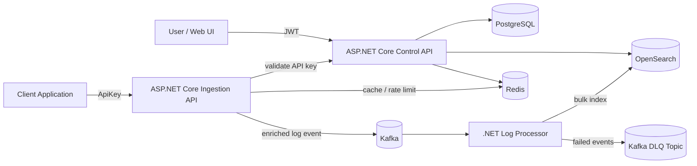

# TraceFlow

> .NET multi-service log ingestion and search pipeline for distributed applications.

TraceFlow là một backend-focused logging platform được xây dựng bằng .NET. Hệ thống cho phép client applications gửi structured logs bằng API key, xử lý log bất đồng bộ qua Kafka, index vào OpenSearch và cho phép user search log theo project scope thông qua Control API.


## 1. Tổng Quan

Trong hệ thống phân tán, log thường nằm rải rác ở nhiều service, container và môi trường khác nhau. Khi xảy ra lỗi, developer phải kiểm tra từng service riêng lẻ, khiến quá trình debug chậm và khó truy vết theo request hoặc tenant context.

TraceFlow giải quyết vấn đề này bằng một pipeline tập trung:

```text
Client Applications
  -> ASP.NET Core Ingestion API
  -> Kafka
  -> .NET Log Processor
  -> OpenSearch
  -> ASP.NET Core Control API
  -> Project-scoped Log Search
```

Core scope của project:

```text
TraceFlow Core = Multi-tenant log ingestion and search pipeline
```

## 2. Tính Năng Chính

- **Multi-tenant resource model**: workspace, project, trace application và API key.
- **JWT-based Control Plane**: user authentication, RBAC và project-scoped access control.
- **ASP.NET Core Ingestion API**: client application gửi log bằng API key, không dùng JWT user.
- **Server-side tenant resolution**: không tin `workspaceId`, `projectId`, `applicationId`, `environment` do client gửi lên.
- **Single và batch log ingestion**: hỗ trợ gửi một log hoặc nhiều log trong một request.
- **Kafka asynchronous pipeline**: tách ingestion khỏi indexing để giảm coupling và hấp thụ traffic spike.
- **.NET Log Processor**: consume Kafka, validate event, buffer batch và index bằng OpenSearch Bulk API.
- **Retry và Dead Letter Queue**: xử lý malformed message, invalid event, full failure và partial failure.
- **Project-scoped Search API**: user chỉ search được log trong project có quyền.
- **Redis-backed protection**: cache API key validation, rate limiting và counter ngắn hạn.
- **System design đầy đủ**: requirements, HLD, contracts, LLD, reliability, security, testing và roadmap.

Nice-to-have được giữ có kiểm soát: retention, quota, operational insights, benchmark report và minimal demo UI. Alerting, backup/restore và advanced dashboard là optional.

## 3. Kiến Trúc & Công Nghệ

TraceFlow tách hệ thống thành hai mặt phẳng trách nhiệm:

| Plane | Công nghệ | Trách nhiệm |
| :--- | :--- | :--- |
| Control Plane | ASP.NET Core | Auth/RBAC, resource management, API key lifecycle, Search API |
| Data Plane | ASP.NET Core + .NET Worker | Log ingestion, Kafka producer/consumer, batch processing, OpenSearch indexing |

### Tech Stack

| Công nghệ | Vai trò |
| :--- | :--- |
| C# / ASP.NET Core | Control API, Ingestion API, RBAC, API key lifecycle, Search API |
| .NET Worker Service | Log Processor, Kafka consumer, batch processing |
| PostgreSQL | Source of truth cho business/control metadata |
| Redis | Validation cache, rate limiting, short-lived counters |
| Kafka | Event stream và buffer giữa ingestion và processing |
| OpenSearch | Log indexing, filtering, full-text search, time-range queries |
| Docker Compose | Local development stack |

### Sơ Đồ Kiến Trúc



### Reliability Model

```text
Accepted != Indexed
Accepted = Kafka đã nhận event
Indexed  = OpenSearch đã lưu document
```

Điều này giúp Ingestion API không phụ thuộc trực tiếp vào OpenSearch. Nếu indexing lỗi, Log Processor chịu trách nhiệm retry hoặc đưa event vào DLQ.

## 4. Bắt Đầu

### Prerequisites

Cần cài trước:

- Docker Desktop hoặc Docker Engine + Docker Compose
- .NET SDK 10.x
- `curl` để kiểm tra health/API

### Installation & Setup

Clone repository:

```bash
git clone <repository-url>
cd TraceFlow
```

Tạo file môi trường:

```bash
cp .env.example .env
```

Nếu chạy Control API bằng Docker Compose, kiểm tra thêm file env của service:

```bash
cp services/control-api/TraceFlow.api/.env.example services/control-api/TraceFlow.api/.env
```

> Lưu ý: thay các secret mặc định trong `.env` trước khi dùng ngoài môi trường local.

### Running With Docker Compose

Khởi động local stack:

```bash
docker compose up -d --build
```

Kiểm tra container:

```bash
docker compose ps
```

Theo dõi log:

```bash
docker compose logs -f control-api ingestion-api log-processor
```

Dừng stack:

```bash
docker compose down
```

Xóa volume local nếu muốn reset dữ liệu:

```bash
docker compose down -v
```

### Local Endpoints

Khi chạy bằng Docker Compose:

| Service | URL |
| :--- | :--- |
| Control API | `http://localhost:5075` |
| Ingestion API | `http://localhost:5100` |
| OpenSearch | `https://localhost:9200` |
| Kafka | `localhost:9092` |

Khi chạy từng service bằng `dotnet run`, port phụ thuộc `launchSettings.json` của từng project. 

### Running Services Locally

Control API:

```bash
dotnet run --project services/control-api/TraceFlow.api/TraceFlow.api.csproj
```

Ingestion API:

```bash
dotnet run --project services/ingestion-api/TraceFlow.Ingestion.Api/TraceFlow.Ingestion.Api.csproj --launch-profile http
```

Log Processor:

```bash
dotnet run --project services/log-processor/TraceFlow.LogProcessor/TraceFlow.LogProcessor.csproj
```

## 5. Usage & API Documentation

Luồng sử dụng chính:

```text
1. User đăng ký/đăng nhập qua Control API.
2. User tạo workspace, project và trace application.
3. User tạo API key cho application.
4. Client application gửi log qua Ingestion API.
5. Log Processor index log vào OpenSearch.
6. User search log qua Control API trong project scope.
```

Ví dụ gửi log:

```bash
curl -X POST http://localhost:5100/logs \
  -H "Authorization: ApiKey <your-api-key>" \
  -H "Content-Type: application/json" \
  -d '{
    "timestamp": "2026-09-19T10:15:30Z",
    "service": "checkout-api",
    "level": "ERROR",
    "message": "Payment provider timeout",
    "traceId": "trace-7f9c2a",
    "correlationId": "order-10001",
    "metadata": {
      "provider": "stripe",
      "durationMs": 3500
    }
    '
```

Tài liệu liên quan:

- [API Documentation](docs/04-api/README.md)
- [OpenAPI Contracts](contracts/openapi/README.md)
- [Kafka Contracts](contracts/kafka/README.md)
- [OpenSearch Contracts](contracts/opensearch/README.md)
- [System Design Contracts](system-design/03-contracts.md)

## 6. Build & Testing

Các test cụ thể sẽ được hoàn thiện theo roadmap. Trong giai đoạn phát triển service, build từng project trước để đảm bảo code và package dependency hợp lệ.

Control API:

```bash
dotnet build services/control-api/TraceFlow.api/TraceFlow.api.csproj
```

Ingestion API:

```bash
dotnet build services/ingestion-api/TraceFlow.Ingestion.Api/TraceFlow.Ingestion.Api.csproj
```

Log Processor:

```bash
dotnet build services/log-processor/TraceFlow.LogProcessor/TraceFlow.LogProcessor.csproj
```

Khi có test project tương ứng, chạy test bằng `dotnet test` theo từng service hoặc solution. Tài liệu testing:

- [Testing Strategy](system-design/07-testing-strategy.md)
- [Testing Docs](docs/09-testing/README.md)
- [Integration Tests](tests/integration/README.md)
- [End-to-End Tests](tests/e2e/README.md)
- [Performance Tests](tests/performance/README.md)

## 7. Cấu Trúc Thư Mục

```text
.
├── services/
│   ├── control-api/       ASP.NET Core Control Plane
│   ├── ingestion-api/     ASP.NET Core Ingestion API
│   └── log-processor/     .NET Worker Kafka Consumer + OpenSearch Indexer
├── contracts/
│   ├── openapi/           HTTP API contracts
│   ├── kafka/             Kafka event schemas
│   └── opensearch/        Index mappings and document contracts
├── system-design/         Requirements, HLD, LLD, reliability, security, testing, roadmap
├── docs/                  Product, architecture, API, data, services, operations, testing docs
├── deployments/           Docker Compose and deployment configuration
├── tests/                 Integration, E2E and performance test docs
├── scripts/               Development and operations helper scripts
└── tools/                 Supporting developer tools
```

## 8. Tài Liệu Thiết Kế

`system-design/` là lớp tài liệu thiết kế gốc:

- [01 - Requirements](system-design/01-requirements.md)
- [02 - High-Level Design](system-design/02-high-level-design.md)
- [03 - Contracts](system-design/03-contracts.md)
- [04 - Low-Level Design](system-design/04-low-level-design.md)
- [05 - Reliability Design](system-design/05-reliability-design.md)
- [06 - Security And Tenancy Design](system-design/06-security-and-tenancy.md)
- [07 - Testing Strategy](system-design/07-testing-strategy.md)
- [08 - Implementation Roadmap](system-design/08-implementation-roadmap.md)

`docs/` là lớp tài liệu sử dụng, vận hành và tham khảo:

- [Documentation Overview](docs/README.md)
- [Product Docs](docs/01-product/README.md)
- [Architecture Docs](docs/02-architecture/README.md)
- [Operations Docs](docs/08-operations/README.md)

## 9. Contributing

Project này dùng format commit:

```text
type(scope): message
```

Ví dụ:

```text
feat(ingestion-api): publish enriched log events
feat(log-processor): add bulk indexing and dlq handling
docs(system-design): add reliability design
test(e2e): verify ingestion to search flow
```

Trước khi mở PR hoặc chốt một phase, cần đảm bảo:

- scope không kéo optional feature vào core
- docs/contracts được cập nhật nếu behavior thay đổi
- test hoặc manual evidence phù hợp đã được ghi nhận
- không commit secret hoặc file môi trường nhạy cảm

## 10. License

License chưa được khai báo trong repository. Nếu project được public/open-source, cần bổ sung file `LICENSE` và cập nhật phần này.

## 11. Tác Giả / Liên Hệ

TraceFlow được xây dựng như một backend engineering portfolio project, tập trung vào system design, multi-service architecture, security, reliability và data pipeline.

Maintainer: `ltthanh`
