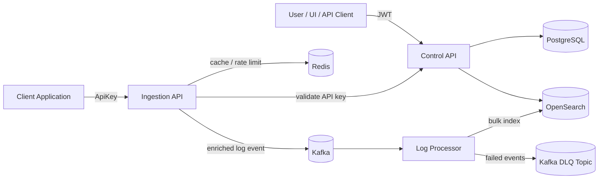

# TraceFlow

> Backend-focused distributed logging platform built with .NET, Kafka, PostgreSQL, Redis and OpenSearch.

TraceFlow is a multi-service observability backend for collecting, processing and searching structured application logs. It provides a Control Plane for users, workspaces, projects, trace applications and API keys, and a Data Plane for high-throughput log ingestion, Kafka buffering, background processing and OpenSearch indexing.


## 1. Overview

In distributed systems, logs are often scattered across services, containers and environments. Debugging production issues becomes slow when developers need to inspect each service manually and correlate requests by hand.

TraceFlow centralizes this workflow:

```text
Client Applications
  -> Ingestion API
  -> Kafka
  -> Log Processor
  -> OpenSearch
  -> Control API
  -> Project-scoped Log Search
```

Core scope:

```text
TraceFlow Core = multi-tenant log ingestion, indexing and project-scoped search
```

The project is designed as a backend engineering portfolio system with emphasis on API design, domain lifecycle rules, security, reliability, data isolation and operational clarity.

## 2. Core Features

- **Multi-tenant resource model**: users, workspaces, projects, trace applications and API keys.
- **Control Plane API**: JWT authentication, refresh token rotation, RBAC, resource lifecycle management and log search.
- **Data Plane API**: API-key-based ingestion for client applications, independent from user JWT authentication.
- **Server-side tenant resolution**: ingestion clients do not provide trusted `workspaceId`, `projectId`, `applicationId` or `environment`; these are resolved from the API key.
- **Single and batch ingestion**: supports both single log events and batch requests.
- **Kafka-backed asynchronous processing**: ingestion is decoupled from OpenSearch indexing.
- **Log Processor worker**: consumes Kafka events, validates payloads, batches documents and indexes through OpenSearch Bulk API.
- **Dead letter handling**: malformed or failed events can be routed to a DLQ topic.
- **Project-scoped search**: users can only search logs inside projects they are allowed to access.
- **Control API request protection**: built-in ASP.NET Core rate limiting, request body limits, forwarded header restrictions and production configuration guards.
- **Ingestion runtime protection**: Redis-backed tenant context cache and ingestion rate limiting.

## 3. Architecture

TraceFlow separates responsibilities into two planes:

| Plane | Services | Responsibility |
| :--- | :--- | :--- |
| Control Plane | `control-api` | Auth, RBAC, workspaces, projects, trace applications, API keys and search API |
| Data Plane | `ingestion-api`, `log-processor` | Log intake, API key validation, Kafka publishing, background processing and OpenSearch indexing |

### Technology Stack

| Technology | Role |
| :--- | :--- |
| C# / ASP.NET Core | Control API, Ingestion API, authentication, RBAC and HTTP APIs |
| .NET Worker Service | Kafka consumer and OpenSearch indexing worker |
| PostgreSQL | Source of truth for users, resources, memberships, invitations, sessions and API keys |
| Redis | Ingestion API cache and rate-limit backing store |
| Kafka | Durable event stream between ingestion and processing |
| OpenSearch | Log indexing and search backend |
| Docker Compose | Local development environment |

### System Diagram


```mermaid
flowchart LR
    User[User / UI / API Client] -->|JWT| ControlAPI[Control API]
    ControlAPI --> Postgres[(PostgreSQL)]
    ControlAPI --> OpenSearch[(OpenSearch)]

    Client[Client Application] -->|ApiKey| IngestionAPI[Ingestion API]
    IngestionAPI -->|validate API key| ControlAPI
    IngestionAPI -->|cache / rate limit| Redis[(Redis)]
    IngestionAPI -->|enriched log event| Kafka[(Kafka)]
    Kafka --> Processor[Log Processor]
    Processor -->|bulk index| OpenSearch
    Processor -->|failed events| DLQ[(Kafka DLQ Topic)]
```

### Reliability Model

```text
Accepted != Indexed
Accepted = Kafka accepted the event
Indexed  = OpenSearch stored the document
```

The Ingestion API does not depend on OpenSearch availability. Indexing is handled asynchronously by the Log Processor, which can retry or route failures to the DLQ.

## 4. Getting Started

### Prerequisites

- Docker Desktop or Docker Engine with Docker Compose
- .NET SDK 10.x
- `curl` for basic API and health checks

### Clone

```bash
git clone <repository-url>
cd TraceFlow
```

### Environment Files

Create the local environment file:

```bash
cp .env.example .env
```

Update secrets before running outside local development:

```text
Jwt__Secret
ApiKeySecurity__Pepper
RefreshTokenSecurity__Pepper
InternalService__Secret
POSTGRES_PASSWORD
OPENSEARCH_INITIAL_ADMIN_PASSWORD
REDIS_PASSWORD
```

## 5. Running The System

### Local Docker Compose

Start the default local stack:

```bash
docker compose up -d --build
```

Check containers:

```bash
docker compose ps
```

Follow logs:

```bash
docker compose logs -f control-api ingestion-api log-processor
```

Stop the stack:

```bash
docker compose down
```

Reset local volumes:

```bash
docker compose down -v
```

### Service Endpoints

Default local endpoints:

| Service | URL |
| :--- | :--- |
| Control API | `http://localhost:5075` |
| Ingestion API | `http://localhost:5100` |
| OpenSearch | `https://localhost:9200` |
| Kafka | `localhost:9092` |

Health checks:

```bash
curl http://localhost:5075/health
curl http://localhost:5100/health
```

### Run Services Locally

Control API:

```bash
dotnet run --project services/control-api/TraceFlow.api/TraceFlow.api.csproj
```

Ingestion API:

```bash
dotnet run --project services/ingestion-api/TraceFlow.Ingestion.Api/TraceFlow.Ingestion.Api.csproj --launch-profile http
```

Log Processor:

```bash
dotnet run --project services/log-processor/TraceFlow.LogProcessor/TraceFlow.LogProcessor.csproj
```

## 6. Usage Flow

Main workflow:

```text
1. Register or log in through the Control API.
2. Create a workspace.
3. Create a project.
4. Create a trace application.
5. Create an API key for the trace application.
6. Send logs to the Ingestion API with the API key.
7. Log Processor indexes events into OpenSearch.
8. Search logs through the Control API with project-scoped authorization.
```

Example ingestion request:

```bash
curl -X POST http://localhost:5100/logs \
  -H "Authorization: ApiKey <your-api-key>" \
  -H "Content-Type: application/json" \
  -d '{
    "timestamp": "2026-09-19T10:15:30Z",
    "service": "checkout-api",
    "level": "ERROR",
    "message": "Payment provider timeout",
    "traceId": "trace-7f9c2a",
    "correlationId": "order-10001",
    "metadata": {
      "provider": "stripe",
      "durationMs": 3500 }
  }'
```

## 7. Build And Test

Build the Control API:

```bash
dotnet build services/control-api/TraceFlow.api/TraceFlow.api.csproj
```

Build the Ingestion API:

```bash
dotnet build services/ingestion-api/TraceFlow.Ingestion.Api/TraceFlow.Ingestion.Api.csproj
```

Build the Log Processor:

```bash
dotnet build services/log-processor/TraceFlow.LogProcessor/TraceFlow.LogProcessor.csproj
```

Run tests:

```bash
dotnet test
```

## 8. Project Structure

```text
.
├── services/
│   ├── control-api/       ASP.NET Core Control Plane
│   ├── ingestion-api/     ASP.NET Core Ingestion API
│   └── log-processor/     .NET Worker Kafka Consumer and OpenSearch Indexer
├── contracts/
│   ├── openapi/           HTTP API contracts
│   ├── kafka/             Kafka event contracts
│   └── opensearch/        OpenSearch document and index contracts
├── deployments/           Docker Compose and deployment configuration
├── docs/                  Product, API, architecture, operations and testing docs
├── system-design/         Requirements, HLD, LLD, reliability, security and roadmap
├── tests/                 Unit, integration, E2E and performance tests/docs
├── scripts/               Development and operations helper scripts
└── tools/                 Supporting developer tools
```

## 9. Documentation

Design and architecture:

- [Requirements](system-design/01-requirements.md)
- [High-Level Design](system-design/02-high-level-design.md)
- [Contracts](system-design/03-contracts.md)
- [Low-Level Design](system-design/04-low-level-design.md)
- [Reliability Design](system-design/05-reliability-design.md)
- [Security And Tenancy Design](system-design/06-security-and-tenancy.md)
- [Testing Strategy](system-design/07-testing-strategy.md)
- [Implementation Roadmap](system-design/08-implementation-roadmap.md)

Operational and service docs:

- [Documentation Overview](docs/README.md)
- [API Documentation](docs/04-api/README.md)
- [Operations Docs](docs/08-operations/README.md)
- [Testing Docs](docs/09-testing/README.md)
- [OpenAPI Contracts](contracts/openapi/README.md)
- [Kafka Contracts](contracts/kafka/README.md)
- [OpenSearch Contracts](contracts/opensearch/README.md)

## 10. License

License has not been declared yet. Add a `LICENSE` file before publishing this project as open source.

## 11. Maintainer

TraceFlow is maintained by `ltthanh` as a backend engineering portfolio project focused on distributed systems, security, reliability and data pipeline design.
