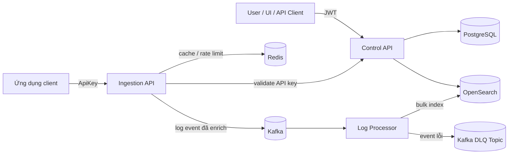

# TraceFlow

> Nền tảng logging backend cho hệ thống phân tán, xây dựng bằng .NET, Kafka, PostgreSQL, Redis và OpenSearch.

TraceFlow là một hệ thống backend nhiều service dùng để thu thập, xử lý, lưu trữ và tìm kiếm structured logs từ các ứng dụng. Hệ thống gồm Control Plane để quản lý user, workspace, project, trace application và API key; cùng Data Plane để tiếp nhận log, đưa vào Kafka, xử lý nền và index vào OpenSearch.


## 1. Tổng Quan

Trong hệ thống phân tán, log thường nằm rải rác ở nhiều service, container và môi trường khác nhau. Khi xảy ra lỗi, developer phải kiểm tra từng service riêng lẻ và tự liên kết log theo request, trace hoặc tenant context. Việc này làm quá trình debug chậm, khó mở rộng và dễ bỏ sót dữ liệu quan trọng.

TraceFlow tập trung hóa quy trình đó:

```text
Ứng dụng client
  -> Ingestion API
  -> Kafka
  -> Log Processor
  -> OpenSearch
  -> Control API
  -> Tìm kiếm log theo phạm vi project
```

Phạm vi lõi của project:

```text
TraceFlow Core = tiếp nhận log đa tenant, index log và tìm kiếm log theo project
```

Project được xây dựng như một backend engineering portfolio project, tập trung vào thiết kế API, vòng đời domain, phân quyền, bảo mật, độ tin cậy, cô lập dữ liệu và khả năng vận hành.

## 2. Tính Năng Chính

- **Mô hình tài nguyên đa tenant**: quản lý user, workspace, project, trace application và API key.
- **Control Plane API**: xác thực JWT, refresh token rotation, RBAC, quản lý tài nguyên và search log.
- **Data Plane API**: tiếp nhận log bằng API key, độc lập với JWT của user.
- **Resolve tenant ở server**: client gửi log không được tự quyết định `workspaceId`, `projectId`, `applicationId` hoặc `environment`; các thông tin này được resolve từ API key.
- **Single và batch ingestion**: hỗ trợ gửi một log hoặc nhiều log trong cùng một request.
- **Xử lý bất đồng bộ bằng Kafka**: tách ingestion khỏi indexing để giảm coupling và hấp thụ traffic spike.
- **Log Processor worker**: consume Kafka events, validate payload, gom batch và index vào OpenSearch bằng Bulk API.
- **Dead letter handling**: event lỗi hoặc không hợp lệ có thể được đưa vào DLQ topic.
- **Tìm kiếm theo project scope**: user chỉ có thể search log trong những project mà họ có quyền truy cập.
- **Bảo vệ Control API**: sử dụng rate limiting built-in của ASP.NET Core, request body limits, forwarded header restrictions và production configuration guards.
- **Bảo vệ Ingestion API**: sử dụng Redis cho tenant context cache và rate limiting ở Ingestion API.

## 3. Kiến Trúc

TraceFlow tách hệ thống thành hai mặt phẳng trách nhiệm:

| Plane | Service | Trách nhiệm |
| :--- | :--- | :--- |
| Control Plane | `control-api` | Auth, RBAC, workspace, project, trace application, API key và search API |
| Data Plane | `ingestion-api`, `log-processor` | Tiếp nhận log, validate API key, publish Kafka, xử lý nền và index OpenSearch |

### Công Nghệ Sử Dụng

| Công nghệ | Vai trò |
| :--- | :--- |
| C# / ASP.NET Core | Control API, Ingestion API, authentication, RBAC và HTTP APIs |
| .NET Worker Service | Kafka consumer và OpenSearch indexing worker |
| PostgreSQL | Source of truth cho user, resource, membership, invitation, session và API key |
| Redis | Cache và rate-limit backing store cho Ingestion API |
| Kafka | Event stream bền vững giữa ingestion và processing |
| OpenSearch | Log indexing và search backend |
| Docker Compose | Môi trường chạy local |

### Sơ Đồ Hệ Thống


```mermaid
flowchart LR
    User[User / UI / API Client] -->|JWT| ControlAPI[Control API]
    ControlAPI --> Postgres[(PostgreSQL)]
    ControlAPI --> OpenSearch[(OpenSearch)]

    Client[Ứng dụng client] -->|ApiKey| IngestionAPI[Ingestion API]
    IngestionAPI -->|validate API key| ControlAPI
    IngestionAPI -->|cache / rate limit| Redis[(Redis)]
    IngestionAPI -->|log event đã enrich| Kafka[(Kafka)]
    Kafka --> Processor[Log Processor]
    Processor -->|bulk index| OpenSearch
    Processor -->|event lỗi| DLQ[(Kafka DLQ Topic)]
```

### Mô Hình Độ Tin Cậy

```text
Accepted != Indexed
Accepted = Kafka đã nhận event
Indexed  = OpenSearch đã lưu document
```

Ingestion API không phụ thuộc trực tiếp vào trạng thái của OpenSearch. Việc index log được xử lý bất đồng bộ bởi Log Processor, có thể retry hoặc đưa event lỗi vào DLQ.

## 4. Bắt Đầu

### Yêu Cầu

- Docker Desktop hoặc Docker Engine có Docker Compose
- .NET SDK 10.x
- `curl` để kiểm tra health/API cơ bản

### Clone Repository

```bash
git clone <repository-url>
cd TraceFlow
```

### Tạo File Môi Trường

Tạo file môi trường local:

```bash
cp .env.example .env
```

Trước khi chạy ngoài môi trường local, cần thay các secret mặc định:

```text
Jwt__Secret
ApiKeySecurity__Pepper
RefreshTokenSecurity__Pepper
InternalService__Secret
POSTGRES_PASSWORD
OPENSEARCH_INITIAL_ADMIN_PASSWORD
REDIS_PASSWORD
```

## 5. Chạy Hệ Thống

### Docker Compose Local

Khởi động local stack:

```bash
docker compose up -d --build
```

Kiểm tra container:

```bash
docker compose ps
```

Theo dõi log:

```bash
docker compose logs -f control-api ingestion-api log-processor
```

Dừng stack:

```bash
docker compose down
```

Xóa volume local nếu muốn reset dữ liệu:

```bash
docker compose down -v
```

### Endpoint Local

| Service | URL |
| :--- | :--- |
| Control API | `http://localhost:5075` |
| Ingestion API | `http://localhost:5100` |
| OpenSearch | `https://localhost:9200` |
| Kafka | `localhost:9092` |

Health checks:

```bash
curl http://localhost:5075/health
curl http://localhost:5100/health
```

### Chạy Từng Service Bằng .NET CLI

Control API:

```bash
dotnet run --project services/control-api/TraceFlow.api/TraceFlow.api.csproj
```

Ingestion API:

```bash
dotnet run --project services/ingestion-api/TraceFlow.Ingestion.Api/TraceFlow.Ingestion.Api.csproj --launch-profile http
```

Log Processor:

```bash
dotnet run --project services/log-processor/TraceFlow.LogProcessor/TraceFlow.LogProcessor.csproj
```

## 6. Luồng Sử Dụng

Luồng chính của hệ thống:

```text
1. User đăng ký hoặc đăng nhập qua Control API.
2. User tạo workspace.
3. User tạo project.
4. User tạo trace application.
5. User tạo API key cho trace application.
6. Ứng dụng client gửi log tới Ingestion API bằng API key.
7. Log Processor index event vào OpenSearch.
8. User search log qua Control API theo project scope.
```

Ví dụ gửi log:

```bash
curl -X POST http://localhost:5100/logs \
  -H "Authorization: ApiKey <your-api-key>" \
  -H "Content-Type: application/json" \
  -d '{
    "timestamp": "2026-09-19T10:15:30Z",
    "service": "checkout-api",
    "level": "ERROR",
    "message": "Payment provider timeout",
    "traceId": "trace-7f9c2a",
    "correlationId": "order-10001",
    "metadata": {
      "provider": "stripe",
      "durationMs": 3500
    }
  }'
```

## 7. Build Và Test

Build Control API:

```bash
dotnet build services/control-api/TraceFlow.api/TraceFlow.api.csproj
```

Build Ingestion API:

```bash
dotnet build services/ingestion-api/TraceFlow.Ingestion.Api/TraceFlow.Ingestion.Api.csproj
```

Build Log Processor:

```bash
dotnet build services/log-processor/TraceFlow.LogProcessor/TraceFlow.LogProcessor.csproj
```

Chạy test:

```bash
dotnet test
```

## 8. Cấu Trúc Thư Mục

```text
.
├── services/
│   ├── control-api/       ASP.NET Core Control Plane
│   ├── ingestion-api/     ASP.NET Core Ingestion API
│   └── log-processor/     .NET Worker Kafka Consumer và OpenSearch Indexer
├── contracts/
│   ├── openapi/           HTTP API contracts
│   ├── kafka/             Kafka event contracts
│   └── opensearch/        OpenSearch document và index contracts
├── deployments/           Docker Compose và deployment configuration
├── docs/                  Product, API, architecture, operations và testing docs
├── system-design/         Requirements, HLD, LLD, reliability, security và roadmap
├── tests/                 Unit, integration, E2E và performance tests/docs
├── scripts/               Development và operations helper scripts
└── tools/                 Supporting developer tools
```

## 9. Tài Liệu

Thiết kế hệ thống:

- [Requirements](system-design/01-requirements.md)
- [High-Level Design](system-design/02-high-level-design.md)
- [Contracts](system-design/03-contracts.md)
- [Low-Level Design](system-design/04-low-level-design.md)
- [Reliability Design](system-design/05-reliability-design.md)
- [Security And Tenancy Design](system-design/06-security-and-tenancy.md)
- [Testing Strategy](system-design/07-testing-strategy.md)
- [Implementation Roadmap](system-design/08-implementation-roadmap.md)

Tài liệu vận hành và service:

- [Documentation Overview](docs/README.md)
- [API Documentation](docs/04-api/README.md)
- [Operations Docs](docs/08-operations/README.md)
- [Testing Docs](docs/09-testing/README.md)
- [OpenAPI Contracts](contracts/openapi/README.md)
- [Kafka Contracts](contracts/kafka/README.md)
- [OpenSearch Contracts](contracts/opensearch/README.md)

## 10. License

Project chưa khai báo license. Nếu public hoặc open-source, cần bổ sung file `LICENSE`.

## 11. Maintainer

TraceFlow được duy trì bởi `ltthanh` như một backend engineering portfolio project, tập trung vào distributed systems, security, reliability và data pipeline design.
