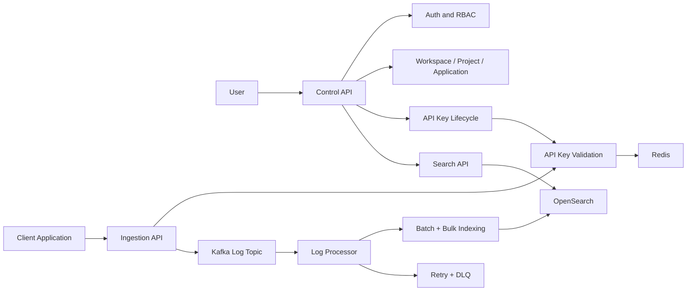

# Requirements

## 1. Problem & Goals

### 1.1. Problem Statement

Trong hệ thống phân tán, log thường được tạo ra từ nhiều service, container và môi trường khác nhau. Nếu không có một pipeline tập trung để thu thập, xử lý và tìm kiếm log, developer phải kiểm tra từng service riêng lẻ khi điều tra lỗi. Việc này làm quá trình debug chậm, rời rạc và khó truy vết theo ngữ cảnh vận hành.

TraceFlow giải quyết bài toán này bằng cách cung cấp một centralized logging backend. Client application gửi structured logs vào hệ thống bằng API key. Log được xác thực, enrich tenant context phía server, publish vào Kafka, xử lý bất đồng bộ bởi Log Processor, index vào OpenSearch và được tìm kiếm thông qua Control API có kiểm soát quyền truy cập.

### 1.2. Product Goal

TraceFlow Core được chốt là:

```text
Multi-tenant log ingestion and search pipeline
```

Điều này nghĩa là project tập trung vào một luồng backend hoàn chỉnh: quản lý tenant/resource, cấp API key, nhận log, xử lý log bất đồng bộ, index log, xử lý lỗi và cho phép user search log theo quyền. TraceFlow không cố trở thành một observability suite lớn; các capability ngoài luồng core phải được giữ nhỏ hoặc đưa sang giai đoạn sau.

### 1.3. Scope Definition

Scope của TraceFlow được chia thành ba tầng để tránh project phình quá lớn. Must-have là phạm vi bắt buộc của hệ thống core. Nice-to-have chỉ làm sau khi core ổn định và phải giữ nhỏ. Optional không được thiết kế như yêu cầu bắt buộc trong giai đoạn đầu.

| Scope | Capability | Vai trò |
| :--- | :--- | :--- |
| Must-have | Auth/RBAC | Xác thực user và kiểm soát quyền theo workspace/project. |
| Must-have | Workspace/Project/Application | Resource hierarchy để định nghĩa tenant boundary và log ownership. |
| Must-have | API Key | Credential riêng cho client application gửi log. |
| Must-have | Ingestion API | Entry point nhận single log và batch logs. |
| Must-have | Kafka | Buffer và stream trung gian giữa ingestion và processing. |
| Must-have | Log Processor | Worker consume Kafka, validate, batch và index log. |
| Must-have | OpenSearch | Search storage cho log document. |
| Must-have | Batch + Bulk Indexing | Tăng throughput và giảm per-message indexing. |
| Must-have | Retry + DLQ | Bảo vệ pipeline trước invalid event và downstream failure. |
| Must-have | Search API | User search log qua Control API với tenant scope. |
| Must-have | Redis | Cache, rate limit và counter ngắn hạn; không phải source of truth. |
| Nice-to-have | Retention | Policy đơn giản như 7/14/30/90 ngày, không archive storage. |
| Nice-to-have | Quota | Bảo vệ ingestion path, không làm billing. |
| Nice-to-have | Operational Insights | Backend summary API cơ bản như volume, error count, error rate, top services. |
| Nice-to-have | Benchmark | Đo throughput, ingestion latency và searchable latency. |
| Nice-to-have | Minimal Web UI | Chỉ để demo luồng chính, không xây dashboard lớn. |
| Optional | Alerting | Để sau vì dễ kéo scheduler, rule engine và notification workflow. |
| Optional | Backup/Restore | Hữu ích cho vận hành nhưng không nằm trong core pipeline. |
| Optional | Advanced Dashboard | Dễ làm project lệch sang frontend/analytics nên không thuộc core. |

### 1.4. Core Capability Map

Sơ đồ dưới đây chốt phạm vi yêu cầu ở mức sản phẩm. Mọi thiết kế chi tiết ở các file sau phải phục vụ trực tiếp một phần của luồng này. Nếu một capability không nằm trong sơ đồ hoặc không làm mạnh hơn luồng này, capability đó không thuộc core scope.



### 1.5. Requirement Traceability

Requirements không chỉ là danh sách mong muốn; mỗi nhóm yêu cầu phải có nơi được thiết kế chi tiết và có bằng chứng kiểm thử tương ứng. Ma trận này giúp giữ tài liệu không bị lý thuyết: đọc từ trái sang phải sẽ thấy yêu cầu, nơi thiết kế, contract cần giữ ổn định và loại test cần chứng minh.

| Capability | Yêu cầu chính | Design owner | Contract chính | Evidence mong muốn |
| :--- | :--- | :--- | :--- | :--- |
| Auth/RBAC | User được xác thực và chỉ thao tác trong resource có quyền. | `06-security-and-tenancy.md`, `04-low-level-design.md` | JWT, permission check, project scope. | Unit/integration test cho auth, membership và forbidden access. |
| Resource hierarchy | Workspace, project và application tạo tenant boundary. | `04-low-level-design.md` | PostgreSQL domain model, resource state. | Test tạo resource, archive/delete và quyền kế thừa. |
| API key | Client application ingest log bằng secret an toàn. | `03-contracts.md`, `06-security-and-tenancy.md` | API key create/validate/revoke, Redis cache. | Test secret one-time display, hash storage, revoke/expire. |
| Ingestion API | Nhận single/batch log, validate và enrich server-side. | `03-contracts.md`, `04-low-level-design.md` | Public ingestion request, enriched Kafka event. | Test success, invalid payload, invalid key, tenant spoofing. |
| Kafka pipeline | Tách ingestion khỏi indexing bằng event stream. | `02-high-level-design.md`, `05-reliability-design.md` | Topic, partition key, schema version. | Test publish/consume và poison message handling. |
| Log Processor | Validate event, buffer batch, bulk index và xử lý lỗi. | `04-low-level-design.md`, `05-reliability-design.md` | Bulk index result, DLQ event. | Test success, retry, full failure, partial failure. |
| Search API | User search log qua Control API, không truy cập OpenSearch trực tiếp. | `03-contracts.md`, `06-security-and-tenancy.md` | Search request/response, scoped query. | Test tenant isolation và filter/pagination. |
| Redis | Cache validation, rate limit và counter ngắn hạn. | `03-contracts.md`, `05-reliability-design.md` | Key format, TTL, fail-open/fail-closed policy. | Test cache hit/miss, stale key, rate limit exceeded. |

## 2. System Actors & Personas

TraceFlow có ba nhóm actor chính. Mỗi actor đi qua một boundary khác nhau để hệ thống không trộn lẫn user management, ingestion tốc độ cao và search.

| Actor | Persona | Main Need | Entry Point |
| :--- | :--- | :--- | :--- |
| Developer / Engineer | Người điều tra lỗi và truy vết hành vi hệ thống. | Search log nhanh theo project, application, environment, service, level, trace ID, correlation ID và time range. | Control API hoặc Minimal Web UI. |
| Workspace / Project Admin | Người quản lý resource, member, quyền truy cập và API key. | Tạo workspace, project, application, cấp/revoke API key và kiểm soát quyền truy cập. | Control API hoặc Minimal Web UI. |
| Client Application | Service bên ngoài gửi structured logs vào TraceFlow. | Gửi log ổn định, bảo mật, ít latency và không cần biết tenant internals. | Ingestion API bằng API key. |

User không truy cập trực tiếp PostgreSQL, Kafka hoặc OpenSearch. Client application không được tự quyết định workspace/project/application context. Log search luôn đi qua Control API để enforce authentication, authorization và tenant scope.

## 3. Functional Requirements & Business Rules

Functional requirements được mô tả theo capability lớn thay vì từng endpoint nhỏ. Mục tiêu là chốt hệ thống phải làm được gì và business rule nào không được phá vỡ.

### 3.1. Identity & Access

Control API cần hỗ trợ user authentication bằng JWT để user quản lý resource và search log. RBAC phải đủ để phân biệt quyền ở workspace và project.

| Requirement | Business Rule |
| :--- | :--- |
| User có thể đăng ký, đăng nhập, refresh session và logout. | JWT chỉ dùng cho user-facing Control API, không dùng để gửi log thay client application. |
| User có quyền theo workspace/project. | Mọi thao tác quản lý resource và search log phải kiểm tra quyền. |
| Search log yêu cầu project access. | User không có quyền project thì không thấy log của project đó. |
| Control API là user-facing boundary chính. | Không expose business metadata trực tiếp từ service khác cho user. |

### 3.2. Resource Management

Resource hierarchy là nền tảng cho tenant isolation và log ownership.

| Requirement | Business Rule |
| :--- | :--- |
| User có thể tạo và quản lý workspace. | Workspace là tenant boundary cấp cao nhất. |
| User có thể tạo project trong workspace. | Project là scope chính cho membership, log ownership và search. |
| User có thể tạo trace application trong project. | Application đại diện workload gửi log. |
| User có thể quản lý member theo quyền. | Quyền project quyết định khả năng search log. |
| Resource có trạng thái active/archived/deleted. | API key thuộc resource không còn hợp lệ phải bị từ chối. |

### 3.3. API Key Lifecycle

API key là credential dành riêng cho ingestion path. Nó không thay thế JWT và không được dùng để gọi API quản trị.

| Requirement | Business Rule |
| :--- | :--- |
| Project admin có thể tạo API key cho trace application. | API key chỉ có quyền `ingest:write`. |
| Full secret chỉ hiển thị một lần khi tạo. | Database không lưu plaintext secret. |
| API key lưu bằng metadata, prefix và secret hash. | Prefix hỗ trợ lookup/audit; hash dùng để verify secret. |
| API key có thể revoke và expire. | Key revoked, expired hoặc thuộc resource archived/deleted bị từ chối. |
| Ingestion API validate API key qua Control API. | Control API trả tenant context hợp lệ khi key còn hiệu lực. |
| Redis có thể cache validation result. | Cache không được làm sai correctness khi key bị revoke/expire. |

### 3.4. Log Ingestion

Ingestion API là entry point duy nhất cho client application gửi log. API này cần trả response nhanh sau khi log hợp lệ được đưa vào Kafka, không chờ OpenSearch indexing.

| Requirement | Business Rule |
| :--- | :--- |
| Nhận single log request. | Request phải có API key hợp lệ. |
| Nhận batch log request. | Batch size và request size phải có giới hạn cấu hình được. |
| Validate payload cơ bản. | Log thiếu field bắt buộc hoặc sai format bị reject bằng response rõ ràng. |
| Enrich tenant context từ API key. | Không tin workspace/project/application/environment do client gửi lên. |
| Publish valid event vào Kafka. | Response success nghĩa là event đã vào pipeline, chưa có nghĩa đã search được. |
| Dùng Redis cho rate limit nếu bật. | Rate limit nhằm bảo vệ ingestion path, không làm billing. |

### 3.5. Log Event Stream

Kafka là buffer giữa ingestion và processing. Event trong Kafka phải là internal contract đã có tenant context để processor không cần gọi PostgreSQL trong hot path.

| Requirement | Business Rule |
| :--- | :--- |
| Enriched log event được publish vào main topic. | Event phải có identity, tenant context, log content và timestamp. |
| Kafka topic chính và DLQ topic tách riêng. | Bad message không làm nghẽn main processing flow. |
| Event schema có version. | Schema evolution phải có đường nâng cấp rõ ràng. |
| Partitioning hỗ trợ scaling. | Partition key sẽ được chốt ở Reliability Design. |

### 3.6. Log Processing & Indexing

Log Processor biến Kafka event thành searchable document trong OpenSearch. Processor xử lý theo batch để tăng throughput và giảm số request indexing.

| Requirement | Business Rule |
| :--- | :--- |
| Consume Kafka event và validate internal event. | Invalid JSON hoặc invalid internal event phải đi DLQ. |
| Buffer valid events thành batch. | Batch phải giữ original Kafka context để DLQ đúng item. |
| Flush batch theo size hoặc interval. | Cả batch size và flush interval phải cấu hình được. |
| Index batch bằng OpenSearch Bulk API. | Không index từng event riêng lẻ trong steady-state processing. |
| Retry full bulk failure. | Nếu vẫn thất bại sau retry, toàn batch đi DLQ. |
| Xử lý partial bulk failure theo item. | Chỉ item lỗi đi DLQ; item đã index thành công không đi DLQ. |

### 3.7. Search API

Search API thuộc Control API. Control API xác thực user, kiểm tra quyền project, build query đã scope theo tenant context và gọi OpenSearch thay user.

| Requirement | Business Rule |
| :--- | :--- |
| User search log theo project. | Query luôn scope theo workspace/project. |
| Hỗ trợ filter theo application, environment, level, service, trace ID, correlation ID và time range. | Filter không được làm mất tenant scope bắt buộc. |
| Search API hỗ trợ pagination. | Không trả kết quả không giới hạn trong một request. |
| Search API có default time range hợp lý. | Tránh query quá rộng khi user không truyền `from`/`to`. |
| OpenSearch không expose trực tiếp cho user. | Mọi search đều đi qua Control API để enforce RBAC. |

### 3.8. Nice-To-Have Functional Scope

Các capability dưới đây có giá trị nhưng không được làm core pipeline bị chậm hoặc phình quá mức.

| Capability | Requirement | Scope Guard |
| :--- | :--- | :--- |
| Retention | Cho phép cấu hình retention đơn giản như 7/14/30/90 ngày. | Không archive storage, không restore log hết hạn. |
| Quota | Giới hạn ingestion volume/request theo API key hoặc project. | Không billing, không pricing plan. |
| Operational Insights | Cung cấp summary API cơ bản từ log data. | Không xây metrics platform hoặc dashboard analytics lớn. |
| Benchmark | Đo throughput, ingestion latency và searchable latency. | Phục vụ evidence cho portfolio, không phải performance lab phức tạp. |
| Minimal Web UI | Demo login, resource setup, API key và log search. | Không làm advanced dashboard. |

## 4. Non-Functional Requirements

Non-functional requirements mô tả chất lượng hệ thống cần đạt được và là nền cho HLD, LLD, Reliability Design và Testing Strategy.

| Category | Requirement | Design Implication |
| :--- | :--- | :--- |
| Scale | Ingestion API xử lý nhiều request đồng thời và không giữ business state dài hạn. | Ingestion API stateless để scale ngang. |
| Throughput | Processor xử lý log theo batch thay vì per-message indexing. | Dùng batch buffer và OpenSearch Bulk API. |
| Latency | Ingestion response không phụ thuộc OpenSearch indexing. | Kafka nằm giữa ingestion và processor; search eventually consistent. |
| Reliability | Log đã accepted vào Kafka không nên mất silently. | Processor cần retry, DLQ và batch-level logs rõ ràng. |
| Failure Isolation | Bad message không được làm nghẽn consumer loop. | Invalid JSON, invalid event và indexing failure đi DLQ. |
| Security | User-facing API dùng JWT; ingestion dùng API key. | Tách rõ user session và application credential. |
| API Key Safety | Secret không lưu plaintext và chỉ hiển thị một lần. | Lưu prefix + hash; không thể lấy lại full secret. |
| Tenant Isolation | User chỉ thấy log trong project được cấp quyền. | Control API enforce RBAC và inject workspace/project scope. |
| Redis Correctness | Redis chỉ là cache/rate limit/counter ngắn hạn. | PostgreSQL vẫn là source of truth cho API key và metadata. |
| Consistency | Log search không cần read-after-write immediate consistency. | Chấp nhận eventual consistency giữa Kafka và OpenSearch. |
| Availability | Nếu OpenSearch lỗi tạm thời, ingestion vẫn có thể nhận log khi Kafka còn hoạt động. | OpenSearch failure xử lý ở processor bằng retry/DLQ. |
| Maintainability | Control Plane và Data Plane có boundary rõ ràng. | Control API quản lý metadata; Go services xử lý ingestion/processing. |

## 5. Back-of-the-Envelope Estimation

Các ước lượng dưới đây là baseline thiết kế, không phải cam kết hiệu năng cuối cùng. Chúng giúp định hướng batch size, retention, Kafka throughput, Redis usage và OpenSearch storage.

### 5.1. Traffic Assumptions

TraceFlow cần đủ tải để chứng minh Kafka và batch processing có ý nghĩa, nhưng không nhắm tới enterprise scale.

| Metric | Initial Target | Reason |
| :--- | :--- | :--- |
| Average ingestion rate | 100-300 logs/s | Phù hợp local/dev benchmark và portfolio scope. |
| Peak ingestion rate | 1,000 logs/s | Đủ để chứng minh Kafka buffering và processor batching. |
| Average log size | 1-2 KB | Structured log có tenant fields, message, correlation fields và metadata. |
| Processor batch size | 100-500 events | Cân bằng throughput, memory usage và searchable latency. |
| Flush interval | 1-5 seconds | Giới hạn thời gian log nằm trong buffer trước khi index. |

### 5.2. Storage Estimation

```text
daily_storage = logs_per_second * average_log_size * 86,400
```

| Scenario | Raw Estimate |
| :--- | :--- |
| 100 logs/s * 1 KB/log | Khoảng 8.6 GB/day |
| 300 logs/s * 1 KB/log | Khoảng 25.9 GB/day |
| 1,000 logs/s * 1 KB/log | Khoảng 86.4 GB/day |

OpenSearch cần nhiều hơn raw payload vì index metadata, inverted index, replicas và field mapping overhead. Vì vậy retention nằm trong nice-to-have nhưng vẫn quan trọng để tránh storage tăng vô hạn.

### 5.3. Resource Assumptions

| Area | Initial Assumption |
| :--- | :--- |
| Kafka bandwidth | 1,000 logs/s với 1 KB/log tương đương khoảng 1 MB/s raw payload, chưa tính protocol overhead. |
| Ingestion API memory | Không giữ batch lớn trong request path; batch ingestion vẫn có size limit. |
| Processor memory | Phụ thuộc batch size, average log size và số partition xử lý đồng thời. |
| OpenSearch pressure | Bulk size cần cấu hình để tránh request quá lớn hoặc quá nhiều request nhỏ. |
| PostgreSQL load | Phục vụ auth, resource metadata và API key validation, không nằm trên log write hot path. |
| Redis usage | Cache validation, rate limit và counter ngắn hạn; dữ liệu mất được và tái tạo từ source of truth khi cần. |

## 6. Assumptions & Constraints

| Type | Decision |
| :--- | :--- |
| Control Plane | ASP.NET Core chịu trách nhiệm authentication, resource management, RBAC, API key lifecycle và log search. |
| Data Plane | Go chịu trách nhiệm ingestion gateway, Kafka producer/consumer và log processing. |
| Business Storage | PostgreSQL là source of truth cho user, workspace, project, application, membership và API key metadata. |
| Event Streaming | Kafka là buffer chính giữa ingestion và processing. |
| Search Storage | OpenSearch là backend chính cho log indexing, filtering và search. |
| Cache/Rate Limit | Redis là must-have supporting infrastructure nhưng không phải source of truth. |
| Local Development | Docker Compose là môi trường local development và demo chính. |
| Consistency Model | Log search là eventually consistent vì ingestion và indexing bất đồng bộ. |
| Scope Control | Core không bao gồm alerting, backup/restore hoặc advanced dashboard. |

### 6.1. Open Decisions

| Decision | Owner Document | Note |
| :--- | :--- | :--- |
| Kafka partition key | Reliability Design | Cần cân bằng ordering, throughput và consumer group scaling. |
| DLQ publish failure behavior | Reliability Design | Cần chốt retry, pause, stop hay continue trong từng tình huống. |
| Exact benchmark target | Testing Strategy | Cần dựa trên local stack hoặc môi trường benchmark ổn định. |
| Redis cache invalidation policy | Reliability Design | Cần chốt TTL và cách invalidate khi API key bị revoke. |
| Retention execution strategy | Implementation Roadmap | Nice-to-have, làm sau core pipeline. |
