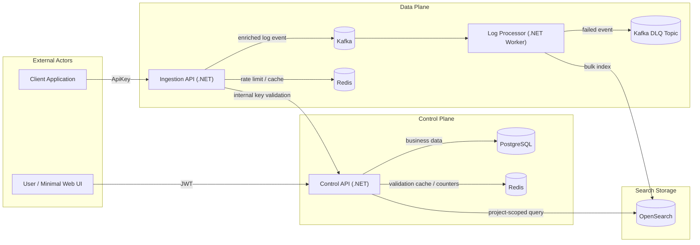

# High-Level Design

## 1. Design Intent

High-Level Design mô tả kiến trúc tổng thể của TraceFlow ở mức service, boundary, data flow và storage. Tài liệu này bám theo scope đã chốt:

```text
TraceFlow Core = Multi-tenant log ingestion and search pipeline
```

Core của hệ thống là luồng log end-to-end: user quản lý resource và API key, client application gửi log vào Ingestion API, event đi qua Kafka, Log Processor index vào OpenSearch, user search log qua Control API. Các capability như retention, quota, operational insights, benchmark và minimal Web UI được xem là nice-to-have. Alerting, backup/restore và advanced dashboard là optional, không chi phối kiến trúc core.

## 2. Scope Alignment

| Scope | HLD Treatment |
| :--- | :--- |
| Must-have | Được thiết kế như thành phần chính của architecture. |
| Nice-to-have | Được giữ ở mức extension nhỏ, không làm thay đổi core flow. |
| Optional | Chỉ ghi nhận boundary, không thiết kế như dependency bắt buộc. |

Must-have gồm Auth/RBAC, Workspace/Project/Application, API Key, Ingestion API, Kafka, Log Processor, OpenSearch, Batch + Bulk Indexing, Retry + DLQ, Search API và Redis. Redis là supporting infrastructure cho cache/rate limit/counter, không phải source of truth và không phải log storage.

## 3. Design Assumptions

| Câu hỏi thiết kế | Câu trả lời cho TraceFlow |
| :--- | :--- |
| How many users? Growing how fast? | Số user quản trị ban đầu không lớn. Tải đáng quan tâm nằm ở ingestion path vì application có thể gửi log liên tục. |
| Read-heavy or write-heavy? | Hệ thống write-heavy ở ingestion path; search ít hơn nhưng cần filter tốt khi debug. |
| What can never lose? | Business metadata trong PostgreSQL không được mất. Log đã accepted vào Kafka phải được index thành công hoặc có DLQ record. API key secret không được lưu plaintext. |
| How much latency can you afford? | Ingestion response cần thấp và không chờ OpenSearch. Searchable latency có thể cao hơn vì pipeline bất đồng bộ và batching. |
| What does it cost? | Kafka, OpenSearch, Redis và Bulk API tăng độ phức tạp nhưng giúp hệ thống có async processing, search, rate protection và reliability rõ ràng. |

## 4. System Context

TraceFlow có ba nhóm actor chính:

| Actor | Vai trò | Entry Point |
| :--- | :--- | :--- |
| User / Developer | Search log, điều tra lỗi, quản lý resource trong phạm vi quyền. | Control API hoặc Minimal Web UI. |
| Workspace / Project Admin | Quản lý workspace, project, application, member và API key. | Control API hoặc Minimal Web UI. |
| Client Application | Gửi structured logs vào TraceFlow. | Ingestion API bằng API key. |

User không truy cập trực tiếp PostgreSQL, Kafka, Redis hoặc OpenSearch. Client application không gọi Control API để gửi log. Mọi log search đều đi qua Control API để enforce RBAC và tenant isolation.

## 5. Architecture Overview

TraceFlow được chia thành hai mặt phẳng trách nhiệm:

| Plane | Components | Responsibility |
| :--- | :--- | :--- |
| Control Plane | Control API, PostgreSQL, Redis cache | Authentication, RBAC, resource management, API key lifecycle, internal validation và log search. |
| Data Plane | Ingestion API, Kafka, Log Processor, OpenSearch, Redis rate limit | Log ingestion, event streaming, batch processing, bulk indexing, retry và DLQ. |

```text
                         +----------------+
                         |   User / UI    |
                         +--------+-------+
                                  |
                                  | JWT
                                  v
                         +----------------+
                         |  Control API   |
                         +---+-----+---+--+
                             |     |   |
                             v     v   v
                     +----------+  |  +-------------+
                     |PostgreSQL|  |  | OpenSearch  |
                     +----------+  |  +-------------+
                                   |
                                   v
                                +-------+
                                | Redis |
                                +-------+


+--------------------+
| Client Application |
+---------+----------+
          |
          | Authorization: ApiKey {secret}
          v
+--------------------+        internal validation        +----------------+
|   Ingestion API    +----------------------------------->+  Control API   |
+----+-----------+---+                                    +----------------+
     |           |
     |           | rate limit / validation cache
     |           v
     |        +-------+
     |        | Redis |
     |        +-------+
     |
     | enriched log event
     v
+--------------------+
|       Kafka        |
+---------+----------+
          |
          | consume
          v
+--------------------+        bulk index        +-------------+
|   Log Processor    +------------------------->+ OpenSearch  |
+---------+----------+                          +-------------+
          |
          | failed event
          v
+--------------------+
|     DLQ Topic      |
+--------------------+
```

Sơ đồ text phía trên mô tả cùng một kiến trúc theo kiểu đọc nhanh. Sơ đồ Mermaid bên dưới là bản dùng để review system design, vì nó thể hiện rõ boundary giữa public API, internal API, storage và asynchronous pipeline.



### 5.1. Runtime Interaction Matrix

| Interaction | Sync/Async | Contract | Latency expectation | Failure boundary |
| :--- | :--- | :--- | :--- | :--- |
| User -> Control API | Synchronous | JWT HTTP API | User-facing latency, ưu tiên rõ lỗi. | Request fail trực tiếp, không retry ẩn. |
| Client -> Ingestion API | Synchronous | API key HTTP API | Nhanh, chỉ chờ validate và publish Kafka. | Reject rõ ràng nếu auth/payload/quota lỗi. |
| Ingestion API -> Control API | Synchronous internal | API key validation contract | Phải ngắn để không làm nghẽn ingestion. | Có Redis cache hỗ trợ, nhưng không phá revoke/expire correctness. |
| Ingestion API -> Kafka | Asynchronous handoff | Enriched log event | Success nghĩa là event đã vào pipeline. | Publish fail trả lỗi ingestion, không giả success. |
| Log Processor -> OpenSearch | Asynchronous downstream | Bulk API/document contract | Tối ưu throughput bằng batch. | Retry trước, DLQ sau theo failure type. |
| Control API -> OpenSearch | Synchronous query | Search contract | Có pagination và default time range. | Fail trả lỗi search an toàn, không expose OpenSearch details. |

### 5.2. Data Ownership Matrix

| Data | Owner | Storage | Read by | Write by |
| :--- | :--- | :--- | :--- | :--- |
| User/session/resource/member/API key metadata | Control API | PostgreSQL | Control API | Control API |
| API key validation cache | Control API/Ingestion API | Redis | Ingestion API | Control API/Ingestion API |
| Rate limit counters | Ingestion API | Redis | Ingestion API | Ingestion API |
| Enriched log event | Ingestion API | Kafka | Log Processor | Ingestion API |
| Indexed log document | Log Processor | OpenSearch | Control API Search | Log Processor |
| DLQ event | Log Processor | Kafka DLQ topic | Debug/replay tooling | Log Processor |

## 6. Component Responsibilities

### 6.1. Control API

Control API là user-facing control plane. Nó quản lý identity, workspace, project, trace application, member, API key lifecycle và log search. Control API cũng cung cấp internal endpoint để Ingestion API validate API key và nhận tenant context.

Control API sử dụng PostgreSQL làm source of truth. Khi cần tối ưu, Control API có thể dùng Redis để cache validation result hoặc lưu counter ngắn hạn, nhưng mọi quyết định đúng/sai cuối cùng về API key và resource status vẫn dựa trên PostgreSQL.

### 6.2. Ingestion API

Ingestion API là gateway nhận log từ client application. Nó đọc API key, validate với Control API hoặc cache hợp lệ trong Redis, kiểm tra rate limit, validate payload, enrich log bằng tenant context và publish event vào Kafka.

Ingestion API không quản lý user/resource và không index trực tiếp vào OpenSearch. Response success của Ingestion API chỉ có nghĩa là event đã được nhận vào pipeline theo policy.

### 6.3. Kafka

Kafka là buffer và event stream giữa ingestion và processing. Kafka giúp tách tốc độ nhận log khỏi tốc độ index log, hỗ trợ consumer group scaling và giữ event trong pipeline khi OpenSearch tạm thời chậm hoặc lỗi.

Kafka có ít nhất hai topic chính: main log topic và DLQ topic.

### 6.4. Log Processor

Log Processor consume Kafka event, parse/validate internal event, buffer valid events thành batch, flush theo batch size hoặc flush interval, và index vào OpenSearch bằng Bulk API.

Processor chịu trách nhiệm reliability của indexing path: retry full bulk failure, đưa toàn batch vào DLQ khi retry exhausted, phát hiện partial bulk failure và chỉ DLQ item lỗi.

### 6.5. OpenSearch

OpenSearch là search storage cho log document. Nó hỗ trợ filtering theo tenant fields, application, environment, level, service, trace ID, correlation ID và time range. OpenSearch không được expose trực tiếp cho user; Control API là reader boundary duy nhất cho user-facing search.

### 6.6. PostgreSQL

PostgreSQL lưu business/control metadata: user, session, workspace, project, membership, trace application và API key metadata/hash. PostgreSQL không lưu high-throughput log events.

### 6.7. Redis

Redis là must-have supporting infrastructure trong scope đã chốt, nhưng vai trò của Redis phải nhỏ và rõ:

| Use case | Purpose | Source of Truth |
| :--- | :--- | :--- |
| API key validation cache | Giảm số lần gọi/lookup validation lặp lại. | PostgreSQL qua Control API. |
| Ingestion rate limit | Chặn burst hoặc client vượt giới hạn. | Redis counter ngắn hạn. |
| Usage/quota counter đơn giản | Theo dõi volume ngắn hạn nếu bật quota. | PostgreSQL/OpenSearch hoặc job tổng hợp nếu cần lưu dài hạn. |

Nếu Redis lỗi, hệ thống có thể degrade bằng cách bỏ cache và gọi Control API trực tiếp. Redis không được là nơi duy nhất quyết định resource ownership hoặc lưu log.

## 7. Main Data Flows

### 7.1. Resource Setup Flow

```text
User
-> Control API
-> PostgreSQL
```

User đăng ký/đăng nhập, tạo workspace, project, trace application và API key. Kết quả là hệ thống có tenant context và credential để client application gửi log.

### 7.2. API Key Validation Flow

```text
Ingestion API
-> Redis cache lookup
-> Control API validation on cache miss
-> PostgreSQL
-> Redis cache write with TTL
-> Tenant context
```

Redis giúp giảm tải validation lặp lại nhưng không thay thế Control API. Khi API key bị revoke hoặc expire, cache phải hết hiệu lực theo TTL/invalidation policy được chốt ở Reliability Design.

### 7.3. Log Ingestion Flow

```text
Client Application
-> Ingestion API
-> Validate API Key
-> Rate Limit Check
-> Validate Payload
-> Enrich Tenant Context
-> Publish Kafka Event
-> Return Accepted
```

Ingestion API không tin tenant fields do client gửi lên. Tenant context luôn đến từ API key hợp lệ.

### 7.4. Log Processing Flow

```text
Kafka
-> Log Processor
-> Parse Event
-> Validate Internal Event
-> Buffer Batch
-> Flush Batch
-> OpenSearch Bulk Index
```

Batching là behavior mặc định của processor. Per-message indexing không phải steady-state path.

### 7.5. Failure & DLQ Flow

```text
Invalid JSON
-> DLQ

Invalid Internal Event
-> DLQ

Full Bulk Failure
-> Retry
-> DLQ Whole Batch if Retry Exhausted

Partial Bulk Failure
-> DLQ Failed Items Only
```

DLQ event phải lưu failure stage, failure reason, original payload, source topic, partition, offset và tenant context nếu parse được.

### 7.6. Log Search Flow

```text
User
-> Control API
-> JWT Authentication
-> Project Access Check
-> Build Scoped OpenSearch Query
-> OpenSearch
-> Return Scoped Result
```

Control API luôn inject `workspaceId` và `projectId` vào query trước khi áp dụng filter khác.

## 8. Storage Design Overview

| Storage | Role | Data |
| :--- | :--- | :--- |
| PostgreSQL | Source of truth cho control data. | User, workspace, project, application, membership, API key metadata/hash. |
| Redis | Cache/rate limit/counter ngắn hạn. | Validation cache, rate limit counter, short-lived usage counter. |
| Kafka | Event stream và buffer. | Enriched log events, DLQ events. |
| OpenSearch | Search storage. | Enriched log documents phục vụ search/filter. |
| Docker Volumes | Local persistence. | Dữ liệu local của PostgreSQL, Kafka, Redis và OpenSearch. |

## 9. Scalability & Reliability Overview

Ingestion API có thể scale ngang vì không giữ business state dài hạn. Kafka hỗ trợ tăng throughput bằng partitioning. Log Processor scale bằng consumer group. OpenSearch scale theo index/shard/node nếu cần, nhưng local development chỉ cần single-node.

Reliability của core pipeline dựa trên các nguyên tắc:

| Principle | Meaning |
| :--- | :--- |
| Accept after Kafka publish | Ingestion success chỉ trả sau khi event vào Kafka. |
| Fail fast invalid request | Payload lỗi bị reject trước Kafka. |
| DLQ bad message | Invalid Kafka message không làm nghẽn consumer loop. |
| Retry full failure | OpenSearch full failure được retry trước khi DLQ. |
| DLQ failed item only | Partial bulk failure không làm DLQ item đã thành công. |
| Redis is disposable | Redis cache/counter không được là nguồn dữ liệu duy nhất. |

## 10. Nice-To-Have And Optional Boundaries

| Capability | HLD Boundary |
| :--- | :--- |
| Retention | Có thể thêm job hoặc API cấu hình đơn giản sau core; không archive/restore. |
| Quota | Dùng Redis counter để bảo vệ ingestion; không billing. |
| Operational Insights | Query summary từ OpenSearch qua Control API; không metrics platform. |
| Benchmark | Script/test đo throughput và latency; không cần infra phức tạp. |
| Minimal Web UI | Gọi Control API để demo core flow; không gọi trực tiếp storage. |
| Alerting | Optional, không ảnh hưởng core architecture. |
| Backup/Restore | Optional documentation/script sau, không nằm trên hot path. |
| Advanced Dashboard | Optional, không thiết kế trong core. |

## 11. Key Design Decisions

| Decision | Rationale |
| :--- | :--- |
| Tách Control API và Ingestion API. | Giữ user management/RBAC tách khỏi high-throughput ingestion path. |
| Dùng Kafka giữa ingestion và processing. | Decouple client-facing ingestion khỏi OpenSearch indexing. |
| Dùng OpenSearch cho log search. | Phù hợp full-text, structured filter và time range query. |
| Dùng PostgreSQL cho control metadata. | Cần consistency, relationship và transaction rõ ràng. |
| Dùng .NET cho các backend service chính. | Đồng nhất stack backend, giảm chi phí vận hành local và vẫn giữ ranh giới service rõ ràng. |
| Dùng Redis trong core nhưng giới hạn vai trò. | Có cache/rate protection thực tế mà không làm sai source of truth. |
