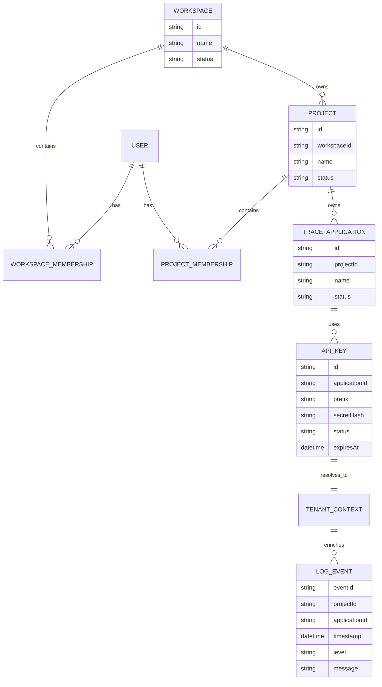
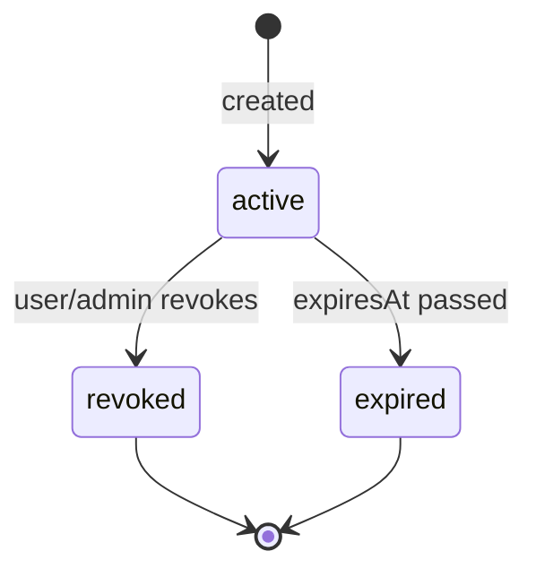
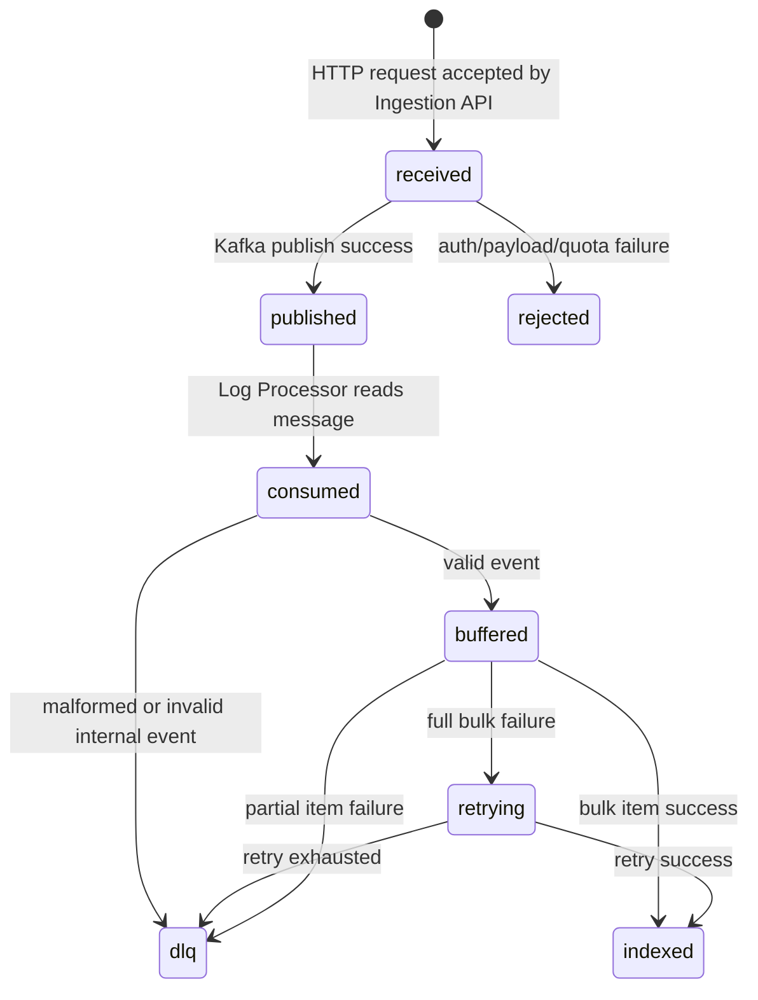
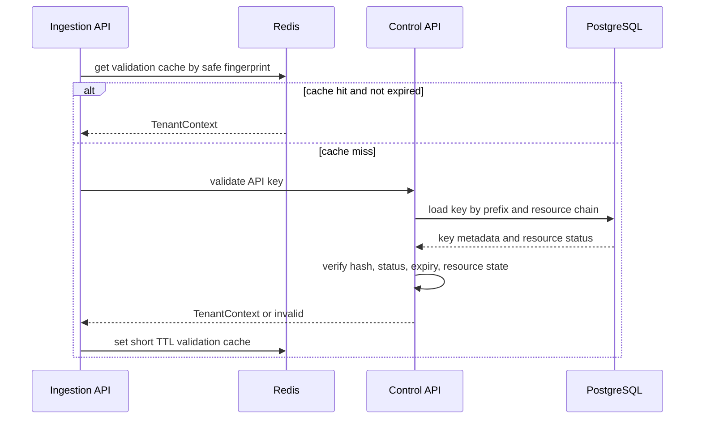
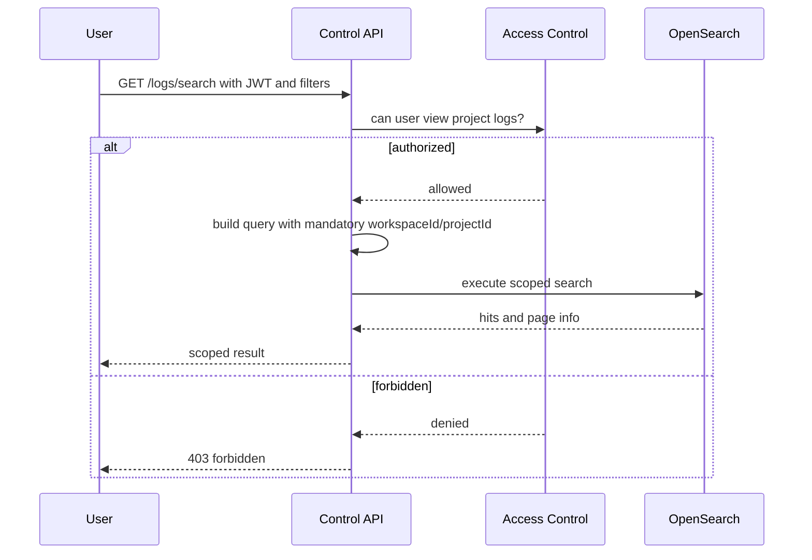
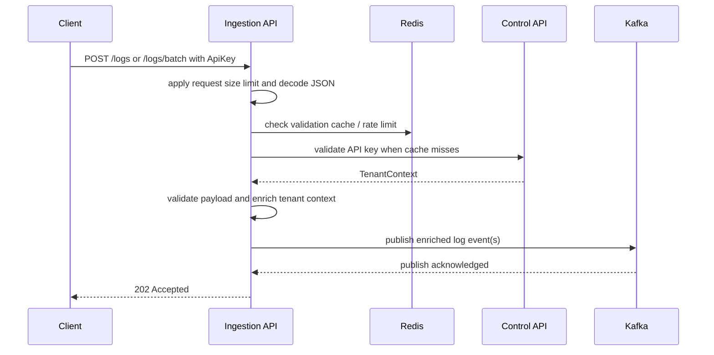
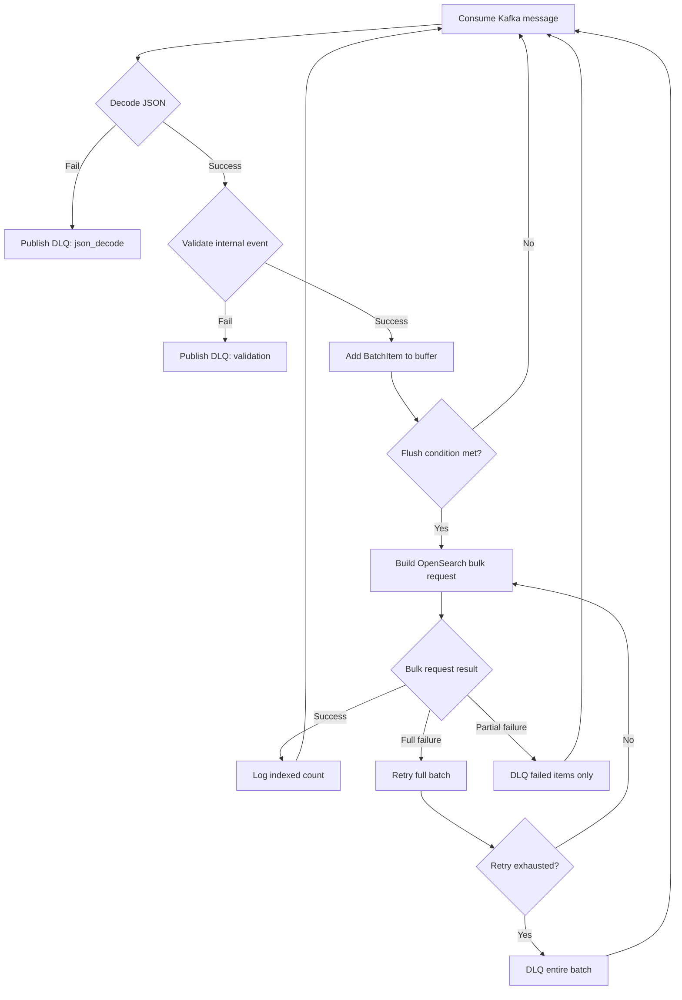

# Low-Level Design

## 1. Mục Tiêu Tài Liệu

Low-Level Design mô tả thiết kế chi tiết cho TraceFlow Core:

```text
Multi-tenant log ingestion and search pipeline
```

Tài liệu này không kể lại code hiện tại và không mô tả tiến độ đã làm. Mục tiêu của LLD là chốt cách hệ thống nên được tổ chức ở mức module, model, interface, state, flow xử lý và failure semantics để khi implementation bắt đầu, từng service đều có hướng đi rõ ràng.

LLD chỉ thiết kế core scope: Auth/RBAC, Workspace/Project/Application, API Key, Ingestion API, Kafka, Log Processor, OpenSearch, Batch + Bulk Indexing, Retry + DLQ, Search API và Redis. Retention, quota, operational insights, benchmark và minimal Web UI là extension nhỏ. Alerting, backup/restore và advanced dashboard không thuộc core LLD.

## 2. Design Boundaries

TraceFlow có ba runtime boundary chính. Mỗi boundary có quyền sở hữu dữ liệu và trách nhiệm riêng, tránh việc service này xử lý logic thuộc service khác.

| Boundary | Owns | Must Not Do |
| :--- | :--- | :--- |
| Control API | User identity, workspace, project, application, RBAC, API key metadata/hash, search authorization. | Không nhận high-throughput log ingestion trực tiếp. |
| Ingestion API | Request validation, API key validation call/cache, rate limit, tenant enrichment, Kafka publish. | Không lưu business metadata, không index OpenSearch. |
| Log Processor | Kafka consume, internal event validation, batching, bulk indexing, retry, DLQ. | Không gọi PostgreSQL để resolve tenant context. |

PostgreSQL là source of truth cho control metadata. Redis là cache/rate-limit/counter ngắn hạn. Kafka là event stream. OpenSearch là search storage. Không storage nào được dùng thay vai trò của storage khác.

## 3. Core Domain Model

Domain model của TraceFlow xoay quanh tenant hierarchy và log ownership.

```text
User
  └── WorkspaceMembership

Workspace
  └── Project
        ├── ProjectMembership
        └── TraceApplication
              └── ApiKey

ApiKey
  └── resolves to TenantContext

TenantContext
  └── attached to LogEvent
```

| Model | Field chính | Ý nghĩa thiết kế |
| :--- | :--- | :--- |
| `Workspace` | `id`, `name`, `status` | Tenant boundary cấp cao nhất. |
| `Project` | `id`, `workspaceId`, `name`, `status` | Scope chính cho log ownership, RBAC và search. |
| `TraceApplication` | `id`, `projectId`, `name`, `status` | Workload gửi log vào TraceFlow. |
| `ApiKey` | `id`, `applicationId`, `prefix`, `secretHash`, `status`, `expiresAt` | Credential ingestion; full secret không được lưu. |
| `TenantContext` | `workspaceId`, `projectId`, `applicationId`, `environment`, `apiKeyId` | Context server-side gắn vào mọi log event. |
| `LogEvent` | `eventId`, `tenantContext`, `timestamp`, `service`, `level`, `message`, `metadata` | Internal event đi qua Kafka và OpenSearch. |

`TenantContext` không được nhận từ client request. Nó chỉ được tạo sau khi API key hợp lệ được validate bởi Control API hoặc cache Redis hợp lệ theo policy.

### 3.1. Domain Relationship Diagram



## 4. State Models

### 4.1. Resource State

Workspace, Project và TraceApplication cần state đủ đơn giản để bảo vệ ingestion và search.

| Trạng thái | Ý nghĩa | API Key Validation |
| :--- | :--- | :--- |
| `active` | Resource đang dùng bình thường. | Có thể hợp lệ nếu API key cũng hợp lệ. |
| `archived` | Resource bị ngừng sử dụng nhưng còn dữ liệu. | API key bị từ chối. |
| `deleted` | Resource không còn được dùng trong hệ thống. | API key bị từ chối. |

Search chỉ trả dữ liệu nếu user có quyền với project. Việc project/application archived có cho search lịch sử hay không sẽ do business policy ở Control API quyết định, nhưng ingestion mới phải bị chặn.

### 4.2. API Key State

```text
active -> revoked
active -> expired
```



| Trạng thái | Ý nghĩa | Behavior khi ingestion |
| :--- | :--- | :--- |
| `active` | Key còn hiệu lực và resource chain active. | Cho phép nếu hash khớp và chưa hết hạn. |
| `revoked` | User/admin đã thu hồi key. | Từ chối ngay. |
| `expired` | Key đã quá thời hạn. | Từ chối ngay. |

Nếu Redis đang cache validation result, revoke phải invalidate cache khi có thể. TTL vẫn cần đủ ngắn để giảm rủi ro stale cache.

### 4.3. Log Event Processing State

```text
received
-> published
-> consumed
-> buffered
-> indexed

received/published/consumed
-> failed
-> dlq
```



| Trạng thái | Service sở hữu | Ý nghĩa |
| :--- | :--- | :--- |
| `received` | Ingestion API | Request đã vào service nhưng chưa chắc vào Kafka. |
| `published` | Ingestion API/Kafka | Event đã được Kafka accept. |
| `consumed` | Log Processor | Processor đã nhận Kafka message. |
| `buffered` | Log Processor | Event hợp lệ đang nằm trong batch buffer. |
| `indexed` | Log Processor/OpenSearch | Event đã được OpenSearch index thành công. |
| `dlq` | Log Processor/Kafka | Event không xử lý được và đã có DLQ record. |

Ingestion response success chỉ tương ứng với `published`, không tương ứng với `indexed`.

## 5. Thiết Kế Control API

Control API là nơi đảm bảo tính đúng đắn của quyền truy cập user, ownership của resource và vòng đời API key.

### 5.1. Module Nội Bộ

| Module | Trách nhiệm | Kết quả đầu ra |
| :--- | :--- | :--- |
| Auth | Đăng nhập, refresh token, logout và phát hành JWT. | User context đã xác thực. |
| Access Control | Kiểm tra quyền ở workspace/project. | Quyết định cho phép hoặc từ chối. |
| Resource Management | Quản lý vòng đời workspace, project và trace application. | Metadata của resource. |
| API Key Management | Tạo, liệt kê, thu hồi và validate API key. | API key metadata hoặc tenant context. |
| Search | Xây dựng OpenSearch query đã scope theo tenant. | Trang kết quả search. |
| Redis Cache Adapter | Đọc, ghi và invalidate validation cache. | Tenant context từ cache hoặc cache miss. |

### 5.2. Contract Kiểm Tra Quyền

Access control chỉ nên trả lời một câu hỏi:

```text
User này có được thực hiện hành động này trên workspace/project/application này không?
```

| Hành động | Điều kiện cần kiểm tra |
| :--- | :--- |
| Tạo project | User có quyền quản lý workspace. |
| Tạo application | User có quyền quản lý project. |
| Tạo hoặc thu hồi API key | User có quyền quản lý application/project. |
| Search logs | User có quyền xem log trong project. |

Handler không tự viết lại logic kiểm tra role. Handler phải gọi access service để giữ business rule nhất quán.

### 5.3. Thuật Toán Validate API Key

```text
Đầu vào: full API key secret

1. Tách key prefix và phần secret.
2. Kiểm tra Redis validation cache bằng fingerprint an toàn.
3. Nếu cache hit và chưa hết hạn, trả về tenant context.
4. Nếu cache miss, load API key theo prefix từ PostgreSQL.
5. Verify secret hash.
6. Kiểm tra trạng thái API key: active, chưa revoked, chưa expired.
7. Kiểm tra trạng thái Workspace/Project/Application: active.
8. Tạo TenantContext.
9. Lưu TenantContext vào Redis với TTL ngắn.
10. Trả về TenantContext.
```

Giá trị trong Redis không được chứa full API key secret hoặc secret hash. Cache key cũng không được chứa raw secret.



### 5.4. Cách Xây Dựng Search Query

Search query phải được xây dựng theo thứ tự cố định:

```text
1. Xác thực user.
2. Kiểm tra quyền truy cập project.
3. Bắt đầu query bằng tenant filters bắt buộc:
   - workspaceId
   - projectId
4. Thêm optional filters:
   - applicationId
   - environment
   - level
   - service
   - traceId
   - correlationId
   - time range
   - full-text query
5. Áp dụng pagination và sort.
6. Thực thi OpenSearch query.
```

Các filter tùy chọn không bao giờ được thay thế tenant filters bắt buộc.



## 6. Thiết Kế Ingestion API

Ingestion API được thiết kế để request path ngắn, dễ dự đoán và có behavior rõ ràng khi lỗi xảy ra.

### 6.1. Module Nội Bộ

| Module | Trách nhiệm |
| :--- | :--- |
| HTTP Transport | Parse header/body, áp dụng body size limit và map lỗi sang HTTP response. |
| API Key Validator | Validate API key qua Redis/Control API và trả tenant context. |
| Rate Limiter | Dùng Redis counter để bảo vệ ingestion path. |
| Payload Validator | Validate payload single log hoặc batch logs. |
| Event Builder | Tạo enriched Kafka event từ request và tenant context. |
| Kafka Publisher | Publish event vào Kafka main topic. |

### 6.2. Thuật Toán Xử Lý Single Log

```text
Đầu vào: HTTP request có API key và log payload

1. Áp dụng request size limit.
2. Lấy API key từ Authorization header.
3. Decode JSON payload.
4. Validate API key và nhận TenantContext.
5. Kiểm tra rate limit bằng TenantContext/apiKeyId.
6. Validate các field của log.
7. Tạo LogEvent với TenantContext phía server.
8. Publish LogEvent vào Kafka.
9. Trả về 202 Accepted.
```

### 6.3. Thuật Toán Xử Lý Batch Logs

```text
Đầu vào: HTTP request có API key và logs[]

1. Áp dụng request size limit.
2. Lấy API key.
3. Decode batch JSON.
4. Validate API key một lần.
5. Kiểm tra rate limit theo số lượng log trong batch.
6. Validate toàn bộ item trong batch.
7. Nếu có item không hợp lệ, reject cả batch trước khi publish Kafka.
8. Tạo một LogEvent cho mỗi item.
9. Publish events vào Kafka.
10. Trả về số lượng log đã accepted.
```

Batch ingestion dùng all-or-nothing validation trước khi publish. Cách này giúp behavior phía client rõ ràng hơn. Trường hợp Kafka publish lỗi giữa batch là quyết định reliability và sẽ được chốt trong `05-reliability-design.md`.



### 6.4. Mapping Lỗi Của Ingestion

| Lỗi | HTTP response | Có vào Kafka không? |
| :--- | :--- | :--- |
| Thiếu API key | `401` | Không |
| API key không hợp lệ | `401` | Không |
| Vượt rate limit | `429` | Không |
| Request JSON không hợp lệ | `400` | Không |
| Log field không hợp lệ | `400` | Không |
| Kafka không khả dụng | `503` | Không hoặc không xác định, tùy kết quả publish |
| Redis không khả dụng | Tùy policy | Validation có thể fallback sang Control API; rate limit policy chốt sau. |

## 7. Thiết Kế Kafka Event

Kafka event là contract nội bộ ổn định giữa Ingestion API và Log Processor.

```text
LogEvent
├── schemaVersion
├── eventId
├── timestamp
├── receivedAt
├── workspaceId
├── projectId
├── applicationId
├── environment
├── service
├── level
├── message
├── traceId
├── correlationId
└── metadata
```

Quy tắc thiết kế:

| Quy tắc | Lý do |
| :--- | :--- |
| `schemaVersion` là bắt buộc. | Hỗ trợ schema evolution. |
| `eventId` được sinh phía server. | Hỗ trợ idempotency/debug trong processor và OpenSearch. |
| Tenant fields là bắt buộc. | Processor không cần gọi PostgreSQL. |
| `receivedAt` là bắt buộc. | Hỗ trợ đo ingestion/searchable latency. |
| Metadata phải có guardrails. | Tránh document quá lớn hoặc nested quá sâu. |

## 8. Thiết Kế Log Processor

Log Processor chịu trách nhiệm chuyển Kafka event thành OpenSearch document một cách đáng tin cậy.

### 8.1. Module Nội Bộ

| Module | Trách nhiệm |
| :--- | :--- |
| Kafka Consumer | Lấy raw message và cung cấp context topic/partition/offset. |
| Event Decoder | Parse JSON và phát hiện malformed message. |
| Event Validator | Validate các internal fields bắt buộc. |
| Batch Buffer | Lưu valid events cho đến khi flush theo size/interval. |
| Bulk Indexer | Gửi batch vào OpenSearch Bulk API. |
| Retry Executor | Retry full bulk failure theo policy. |
| DLQ Publisher | Publish raw message/event/item lỗi vào DLQ topic. |
| Processing Logger | Ghi batch-level result và failure context. |

### 8.2. Batch Item Model

Mỗi item trong batch phải giữ cả event đã normalize và Kafka context gốc.

| Field | Mục đích |
| :--- | :--- |
| `event` | LogEvent đã normalize để index. |
| `rawPayload` | Kafka payload gốc để đưa vào DLQ/debug. |
| `topic` | Topic nguồn. |
| `partition` | Partition nguồn. |
| `offset` | Offset nguồn. |
| `receivedByProcessorAt` | Thời điểm processor nhận message để debug latency. |

Nếu không giữ Kafka context, processor không thể đưa đúng item lỗi vào DLQ khi xảy ra partial failure.

### 8.3. Thuật Toán Xử Lý

```text
Với mỗi Kafka message:

1. Decode raw payload.
2. Nếu JSON decode thất bại:
   - publish DLQ với stage json_decode
   - tiếp tục xử lý message tiếp theo
3. Validate internal LogEvent.
4. Nếu validation thất bại:
   - publish DLQ với stage validation
   - tiếp tục xử lý message tiếp theo
5. Thêm BatchItem vào buffer.
6. Flush buffer khi:
   - đạt batch size, hoặc
   - flush interval đã trôi qua
```

Thuật toán flush:

```text
Đầu vào: BatchItem[]

1. Tạo OpenSearch bulk request.
2. Thực thi bulk request.
3. Nếu full request failure:
   - retry theo policy
   - nếu retry exhausted, đưa toàn batch vào DLQ
4. Nếu partial item failure:
   - chỉ đưa failed items vào DLQ
   - không đưa successful items vào DLQ
5. Nếu success:
   - log indexed count
```

### 8.4. Bulk Index Result Model

| Result Type | Ý nghĩa | Behavior bắt buộc của Processor |
| :--- | :--- | :--- |
| `success` | Tất cả item được index thành công. | Log success và tiếp tục xử lý. |
| `full_failure` | Bulk request fail toàn bộ, không có item-level result đáng tin cậy. | Retry full batch, sau đó DLQ toàn batch nếu hết retry. |
| `partial_failure` | Bulk request có response item-level nhưng một số item fail. | Chỉ DLQ failed items. |

Việc phân biệt này là bắt buộc. Nếu xử lý partial failure như full failure, processor sẽ đưa nhầm cả những item đã index thành công vào DLQ.



## 9. Thiết Kế DLQ

DLQ là safety boundary cho các message không thể xử lý thành công. DLQ event phải giữ đủ context để debug lỗi mà không cần đọc lại Kafka topic gốc.

| Failure Stage | Nguồn lỗi | DLQ payload |
| :--- | :--- | :--- |
| `json_decode` | Raw Kafka message không parse được. | Raw payload, source topic/partition/offset, reason. |
| `validation` | Event parse được nhưng vi phạm internal contract. | Parsed fields nếu có, raw payload, reason. |
| `indexing` | OpenSearch indexing thất bại sau policy. | Event, tenant fields, item-level reason nếu có. |

DLQ publisher không được silently drop khi publish DLQ thất bại. Behavior chính xác khi DLQ publish failure sẽ được chốt trong Reliability Design.

## 10. Thiết Kế Redis

Redis thuộc core infrastructure, nhưng vai trò được giới hạn có chủ đích.

| Use case của Redis | Thuộc tính chính | Kỳ vọng khi lỗi |
| :--- | :--- | :--- |
| API key validation cache | TTL ngắn, không lưu raw secret, invalidate khi revoke nếu có thể. | Fallback sang Control API validation khi cache lỗi hoặc cache miss. |
| Rate limit counter | Counter theo time-window cho API key/project. | Fail-open/fail-closed sẽ chốt trong Reliability Design. |
| Short usage counter | Theo dõi volume tạm thời. | Có thể rebuild hoặc bỏ qua nếu không dùng cho billing. |

Redis không bao giờ được là nơi duy nhất lưu API key state, tenant ownership, log events hoặc search documents.

## 11. Thiết Kế Configuration

Core configuration cần làm behavior của hệ thống rõ ràng và dễ test.

| Config | Service sở hữu | Mục đích |
| :--- | :--- | :--- |
| `MAX_REQUEST_BYTES` | Ingestion API | Bảo vệ request path. |
| `MAX_BATCH_ITEMS` | Ingestion API | Giới hạn batch ingestion từ client. |
| `API_KEY_CACHE_TTL` | Control/Ingestion | Giới hạn độ stale của Redis validation cache. |
| `RATE_LIMIT_WINDOW` | Ingestion API | Time window cho rate limit. |
| `PROCESSOR_BATCH_SIZE` | Log Processor | Flush theo size. |
| `PROCESSOR_FLUSH_INTERVAL` | Log Processor | Flush theo thời gian. |
| `BULK_RETRY_ATTEMPTS` | Log Processor | Retry full bulk failure. |
| `BULK_RETRY_BACKOFF` | Log Processor | Tránh hammer OpenSearch. |
| `DLQ_TOPIC` | Log Processor | Route failed events. |

## 12. Extension Points

Nice-to-have features được thiết kế như extension, không phải dependency của core.

| Capability | Extension Point | Guardrail |
| :--- | :--- | :--- |
| Retention | Background job hoặc Control API policy config. | Chỉ dùng fixed retention values, không archive/restore. |
| Quota | Redis counters trong ingestion path. | Bảo vệ ingestion, không làm billing model. |
| Operational Insights | Control API đọc OpenSearch aggregations. | Chỉ summary API. |
| Benchmark | Performance scripts đo ingestion/searchable latency. | Làm evidence cho portfolio, không làm load lab phức tạp. |
| Minimal Web UI | Thin client gọi Control API. | Chỉ demo core flows. |

Optional alerting, backup/restore và advanced dashboard không được làm thay đổi core module boundaries.

## 13. Tiêu Chí Đạt Của LLD

| Tiêu chí | Kết quả thiết kế mong muốn |
| :--- | :--- |
| Thiết kế hướng tới target system. | Tài liệu định nghĩa hệ thống nên được xây như thế nào, không kể lại hiện trạng code. |
| Tenant context được xác định phía server. | Client không spoof được workspace/project/application/environment. |
| Control Plane và Data Plane tách biệt. | Control API sở hữu metadata; Ingestion API và Log Processor xử lý ingestion/processing. |
| Processor hot path tránh PostgreSQL. | Kafka event đã mang đủ tenant context. |
| Redis hữu ích nhưng có giới hạn. | Chỉ dùng cache/rate limit/counter, không có vai trò source of truth. |
| Bulk indexing failure semantics rõ ràng. | Full failure và partial failure có behavior khác nhau. |
| Optional features vẫn là optional. | Alerting/backup/dashboard không ảnh hưởng core design. |
