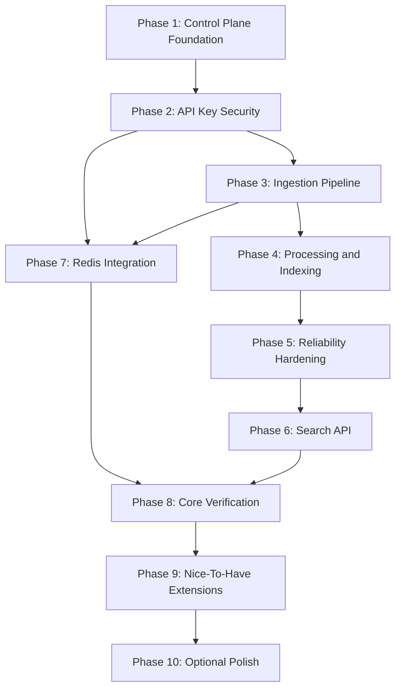

# Implementation Roadmap

## 1. Mục Tiêu Roadmap

Implementation Roadmap chuyển toàn bộ system design của TraceFlow thành kế hoạch triển khai theo phase. Tài liệu này không phải backlog chi tiết từng ticket nhỏ, mà là bản đồ để phát triển hệ thống theo đúng scope đã chốt:

```text
TraceFlow Core = Multi-tenant log ingestion and search pipeline
```

Roadmap ưu tiên xây core pipeline trước, sau đó mới mở rộng sang nice-to-have. Optional features không được chen vào làm chậm hoặc làm lệch core.

Nguyên tắc triển khai:

| Nguyên tắc | Ý nghĩa |
| :--- | :--- |
| Core first | Auth/RBAC, API key, ingestion, Kafka, processor, OpenSearch, retry/DLQ và search phải hoàn thiện trước. |
| Vertical slices | Mỗi phase nên tạo ra một luồng chạy được hoặc một capability backend rõ ràng. |
| Evidence-driven | Mỗi phase phải có test hoặc manual evidence chứng minh hoạt động đúng. |
| Scope control | Retention, quota, insights, benchmark và UI chỉ làm sau khi core ổn định. |
| Optional stays optional | Alerting, backup/restore và advanced dashboard không phải điều kiện hoàn thiện core project. |

## 2. Roadmap Overview

Roadmap được chia thành ba lớp: Core, Nice-to-have và Optional.

| Layer | Phase | Outcome |
| :--- | :--- | :--- |
| Core | Phase 1: Control Plane Foundation | Có auth, workspace/project/application và RBAC nền tảng. |
| Core | Phase 2: API Key Security | Có API key lifecycle và internal validation. |
| Core | Phase 3: Ingestion Pipeline | Client gửi log vào Kafka bằng API key. |
| Core | Phase 4: Processing And Indexing | Processor consume Kafka, batch và bulk index OpenSearch. |
| Core | Phase 5: Reliability Hardening | Retry, DLQ, full/partial failure handling hoàn chỉnh. |
| Core | Phase 6: Search API | User search log qua Control API theo project scope. |
| Core | Phase 7: Redis Integration | Validation cache, rate limit và counter ngắn hạn đúng boundary. |
| Core | Phase 8: Core Verification | E2E, security, reliability và benchmark baseline. |
| Nice-to-have | Phase 9: Controlled Extensions | Retention, quota, operational insights, minimal UI nếu cần. |
| Optional | Phase 10: Optional Polish | Alerting, backup/restore hoặc advanced dashboard chỉ làm nếu core đã rất ổn. |

## 3. Phase 1: Control Plane Foundation

Phase này xây nền tảng quản trị resource và quyền truy cập. Đây là điều kiện trước khi làm ingestion vì API key và tenant context phụ thuộc vào workspace/project/application.

### Scope

| Capability | Expected Output |
| :--- | :--- |
| User authentication | User có thể đăng ký/đăng nhập và nhận JWT. |
| Workspace management | User tạo và xem workspace. |
| Project management | User tạo project trong workspace. |
| Trace application management | User tạo application trong project. |
| RBAC foundation | Control API kiểm tra quyền workspace/project ở các command/query chính. |

### Design Constraints

Control API là source of truth cho business metadata. Không service nào khác được tự quản lý workspace/project/application. RBAC logic phải tập trung trong access service, không rải rác trong controller.

### Evidence

| Evidence | Meaning |
| :--- | :--- |
| Auth tests | JWT hợp lệ/không hợp lệ được xử lý đúng. |
| Resource tests | Workspace/project/application được tạo đúng hierarchy. |
| RBAC tests | User không có quyền không thao tác được resource. |

## 4. Phase 2: API Key Security

Phase này mở ingestion boundary an toàn. API key là credential của client application, khác hoàn toàn JWT của user.

### Scope

| Capability | Expected Output |
| :--- | :--- |
| Create API key | Project admin tạo API key cho application. |
| Secret display once | Full secret chỉ trả một lần khi tạo. |
| Secure storage | Database chỉ lưu prefix, metadata và secret hash. |
| Revoke/expire | Key revoked/expired bị từ chối. |
| Internal validation | Ingestion API có endpoint nội bộ để validate key và nhận tenant context. |

### Design Constraints

API key không được dùng cho management/search API. Internal validation response chỉ trả tenant context tối thiểu, không trả secret/hash/database detail.

### Evidence

| Evidence | Meaning |
| :--- | :--- |
| API key lifecycle tests | Create/list/revoke/expire hoạt động đúng. |
| Secret handling tests | Full secret không xuất hiện trong list/detail/log. |
| Validation tests | Active key trả tenant context, revoked/expired key trả invalid. |

## 5. Phase 3: Ingestion Pipeline

Phase này tạo đường đi thật cho client application gửi log vào hệ thống. Output quan trọng nhất là Kafka event đã được enrich tenant context phía server.

### Scope

| Capability | Expected Output |
| :--- | :--- |
| Single log ingestion | Client gửi một log hợp lệ bằng API key. |
| Batch log ingestion | Client gửi nhiều log trong một request. |
| Payload validation | Request sai bị reject trước Kafka. |
| Tenant enrichment | Event vào Kafka có workspace/project/application/environment từ API key. |
| Kafka producer | Ingestion API publish event vào `traceflow.logs`. |

### Design Constraints

Ingestion API không được tin tenant fields từ client. Response `202 Accepted` chỉ được trả sau khi Kafka nhận event theo publish policy. Accepted không có nghĩa log đã search được.

### Evidence

| Evidence | Meaning |
| :--- | :--- |
| Valid ingestion test | Valid request publish đúng Kafka event. |
| Invalid payload test | Invalid request không vào Kafka. |
| Tenant spoofing test | Client gửi tenant fields sai nhưng event vẫn dùng server-side context. |
| Kafka failure test | Kafka publish fail không trả accepted sai. |

## 6. Phase 4: Processing And Indexing

Phase này hoàn thiện phần dữ liệu đi từ Kafka sang OpenSearch. Đây là phase biến ingestion thành searchable log pipeline.

### Scope

| Capability | Expected Output |
| :--- | :--- |
| Kafka consumer | Log Processor consume `traceflow.logs`. |
| Internal event validation | Event thiếu field bắt buộc bị xử lý theo failure path. |
| Batch buffer | Valid events được buffer theo batch size/flush interval. |
| OpenSearch Bulk API | Batch được index bằng Bulk API. |
| Log document mapping | OpenSearch document có đủ tenant fields và search fields. |

### Design Constraints

Processor không gọi PostgreSQL để resolve tenant. Mọi tenant context phải có trong Kafka event. Batch item phải giữ Kafka context để phục vụ DLQ chính xác ở phase reliability.

### Evidence

| Evidence | Meaning |
| :--- | :--- |
| Processor success test | Kafka event hợp lệ được index vào OpenSearch. |
| Batch flush test | Flush đúng theo size hoặc interval. |
| Search storage check | OpenSearch document có workspace/project/application/environment. |

## 7. Phase 5: Reliability Hardening

Phase này làm cho pipeline đáng tin hơn bằng retry, DLQ và phân biệt full/partial failure. Đây là phase quan trọng để TraceFlow vượt khỏi demo đơn giản.

### Scope

| Capability | Expected Output |
| :--- | :--- |
| Invalid JSON DLQ | Malformed Kafka message đi DLQ stage `json_decode`. |
| Invalid event DLQ | Internal event sai schema đi DLQ stage `validation`. |
| Full bulk failure retry | OpenSearch full failure được retry theo policy. |
| Full failure DLQ | Hết retry thì toàn batch đi DLQ stage `indexing`. |
| Partial failure handling | Chỉ failed items đi DLQ, successful items không đi DLQ. |
| Processor observability | Log batch size, indexed count, failed count, retry attempts, DLQ result. |

### Design Constraints

Partial failure không được xử lý như full failure. DLQ event phải lưu original payload, source topic, partition, offset, failure reason và tenant context nếu có.

### Evidence

| Evidence | Meaning |
| :--- | :--- |
| Full failure test | Retry rồi DLQ toàn batch nếu OpenSearch vẫn fail. |
| Partial failure test | Chỉ item lỗi vào DLQ. |
| DLQ content test | DLQ event có đủ source context và failure reason. |
| Processor log evidence | Batch-level logs đủ để debug. |

## 8. Phase 6: Search API

Phase này cho user khai thác log đã được index. Search phải luôn đi qua Control API để enforce RBAC và tenant isolation.

### Scope

| Capability | Expected Output |
| :--- | :--- |
| Project-scoped search endpoint | User search log theo workspace/project. |
| Tenant-scoped OpenSearch query | Query bắt buộc filter `workspaceId` và `projectId`. |
| Search filters | Filter theo application, environment, level, service, trace ID, correlation ID và time range. |
| Pagination | Search không trả kết quả không giới hạn. |
| Search failure handling | OpenSearch timeout/error trả response an toàn. |

### Design Constraints

User-provided filters không được override tenant scope. User không có quyền project không được search log của project đó.

### Evidence

| Evidence | Meaning |
| :--- | :--- |
| Project access test | User không có quyền không search được log. |
| Filter tests | Filter hoạt động trong tenant scope. |
| Cross-tenant test | Project A không thấy log project B. |
| OpenSearch failure test | Search error không leak raw stack trace. |

## 9. Phase 7: Redis Integration

Redis nằm trong must-have scope nhưng vai trò phải có giới hạn: cache, rate limit và counter ngắn hạn.

### Scope

| Capability | Expected Output |
| :--- | :--- |
| API key validation cache | Ingestion giảm call lặp lại tới Control API. |
| Cache TTL | Stale cache được giới hạn bằng TTL ngắn. |
| Cache invalidation | Revoke key invalidate cache nếu có thể. |
| Rate limit counter | Ingestion path có bảo vệ burst traffic đơn giản. |
| Redis fallback | Redis lỗi không làm sai tenant ownership. |

### Design Constraints

Redis không lưu full API key secret, secret hash hoặc log payload. PostgreSQL/Control API vẫn là source of truth.

### Evidence

| Evidence | Meaning |
| :--- | :--- |
| Cache hit/miss test | Validation cache hoạt động đúng. |
| Redis unavailable test | Fallback Control API cho validation. |
| Revoked key cache test | Revoked key không tiếp tục hợp lệ quá TTL/invalidation policy. |
| Rate limit test | Vượt ngưỡng trả `429` khi Redis hoạt động. |

## 10. Phase 8: Core Verification

Phase này gom evidence để chứng minh core pipeline hoàn chỉnh. Đây là điểm nên chốt trước khi mở rộng nice-to-have.

### Required End-To-End Flow

```text
User creates workspace/project/application
-> User creates API key
-> Client ingests logs
-> Ingestion API publishes Kafka events
-> Log Processor indexes OpenSearch
-> User searches logs through Control API
```

### Required Evidence

| Evidence | Required Result |
| :--- | :--- |
| E2E success path | Log hợp lệ đi từ ingestion đến search. |
| Security path | Revoked/expired key bị từ chối, user không có quyền không search được log. |
| Reliability path | Invalid JSON, invalid event, full failure và partial failure xử lý đúng. |
| Benchmark baseline | Có logs/s throughput và P95 latency baseline. |

Core chỉ nên được xem là ổn định khi các evidence này có thể chạy lại được bằng command/script rõ ràng.

## 11. Phase 9: Nice-To-Have Extensions

Sau khi core ổn định, có thể bổ sung các extension nhỏ. Mỗi extension phải giữ đúng guardrail để không làm project phình quá lớn.

| Capability | Scope | Guardrail |
| :--- | :--- | :--- |
| Retention | Fixed policy như 7/14/30/90 ngày. | Không archive/restore. |
| Quota | Limit volume/request để bảo vệ ingestion. | Không billing/pricing. |
| Operational Insights | Summary API: volume, error count, error rate, top services. | Không metrics platform. |
| Benchmark | Script đo throughput/P95 latency. | Không cần performance lab phức tạp. |
| Minimal Web UI | Login, resource setup, API key, log search. | Không advanced dashboard. |

Nice-to-have phải được triển khai từng capability riêng, có test/evidence riêng và không làm thay đổi core contract nếu không cần thiết.

## 12. Phase 10: Optional Polish

Optional features chỉ nên làm khi core và nice-to-have quan trọng đã hoàn thiện.

| Capability | Khi nào cân nhắc |
| :--- | :--- |
| Alerting | Khi operational insights đã ổn và cần rule đơn giản. |
| Backup/Restore | Khi muốn bổ sung tài liệu vận hành hoặc demo recovery local. |
| Advanced Dashboard | Chỉ khi có thời gian dư và không làm lệch trọng tâm backend. |

Các feature này không phải điều kiện để TraceFlow được xem là portfolio-ready.

## 13. Suggested Branch Strategy

Branch nên đại diện cho capability có ý nghĩa, không tạo branch quá nhỏ chỉ cho vài dòng nếu không có giá trị độc lập.

| Phase | Suggested Branch |
| :--- | :--- |
| Control Plane Foundation | `feature/control-plane-foundation` |
| API Key Security | `feature/api-key-lifecycle` |
| Ingestion Pipeline | `feature/ingestion-pipeline` |
| Processing And Indexing | `feature/log-processing-indexing` |
| Reliability Hardening | `feature/processor-reliability` |
| Search API | `feature/log-search` |
| Redis Integration | `feature/redis-ingestion-protection` |
| Core Verification | `feature/core-verification` |
| Nice-To-Have Extensions | Theo capability riêng, ví dụ `feature/log-retention`. |

Commit message nên theo format:

```text
type(scope): message
```

Ví dụ:

```text
feat(control-api): add api key lifecycle
feat(ingestion-api): publish enriched log events
feat(log-processor): add bulk indexing and dlq handling
test(e2e): verify ingestion to search flow
docs(system-design): update reliability decisions
```

## 14. Definition Of Done

Một phase chỉ nên xem là hoàn thành khi có đủ implementation, test và evidence.

| Requirement | Meaning |
| :--- | :--- |
| Code complete | Capability hoạt động theo contract/design đã chốt. |
| Tests pass | Unit/integration/E2E hoặc reliability tests phù hợp đã chạy. |
| Failure behavior verified | Các lỗi chính trong phase có test hoặc manual evidence. |
| Docs updated | Contract/design/README được cập nhật nếu behavior thay đổi. |
| No scope leak | Không kéo optional feature vào core nếu không cần. |

Definition of Done giúp TraceFlow tránh trạng thái “có code nhưng chưa chứng minh được hệ thống đúng”.

## 15. Portfolio-Ready Criteria

TraceFlow được xem là portfolio-ready khi core pipeline có thể demo và có evidence rõ ràng.

| Criterion | Expected Evidence |
| :--- | :--- |
| End-to-end pipeline | Client gửi log và user search được log qua Control API. |
| Multi-tenancy | Cross-project/workspace access bị chặn. |
| Secure ingestion | API key lifecycle an toàn, revoked/expired key bị từ chối. |
| Async processing | Kafka decouple ingestion và indexing. |
| Bulk indexing | Processor dùng batch và OpenSearch Bulk API. |
| Reliability | Retry, DLQ, full failure và partial failure hoạt động đúng. |
| Redis integration | Cache/rate limit/counter dùng đúng vai trò supporting infrastructure. |
| Benchmark | Có throughput logs/s và P95 latency baseline. |
| Documentation | System design, setup, verification và project story rõ ràng. |

Khi đạt các tiêu chí này, TraceFlow có thể được mô tả như một backend project hoàn chỉnh thay vì một tập hợp service rời rạc.

## 16. Roadmap Dependency Graph

Roadmap không nên được hiểu như danh sách việc độc lập. Mỗi phase tạo nền cho phase sau, và core pipeline chỉ thật sự có giá trị khi đi được từ resource setup đến search result.



## 17. Phase Artifact Matrix

| Phase | Main deliverable | Design artifact cần khớp | Evidence bắt buộc |
| :--- | :--- | :--- | :--- |
| 1 | Auth/RBAC/resource foundation | Domain model, permission contract | Auth/resource tests pass. |
| 2 | Secure API key lifecycle | API key contract, lifecycle state | Secret one-time display, revoke/expire validation. |
| 3 | Ingestion API + Kafka publish | Ingestion contract, Kafka event schema | Single/batch log accepted into Kafka. |
| 4 | Processor + OpenSearch bulk indexing | Batch/bulk flow, document contract | Valid batch indexed and searchable. |
| 5 | Retry + DLQ hardening | Reliability flow diagrams | Full failure, partial failure and malformed event evidence. |
| 6 | Project-scoped Search API | Search contract, tenant query builder | Cross-project search blocked. |
| 7 | Redis cache/rate limit/counter | Redis key contract, reliability policy | Cache hit/miss, fallback and rate limit evidence. |
| 8 | Core verification | Requirement-to-test matrix | E2E success plus benchmark baseline. |
| 9 | Nice-to-have extensions | Scope table in requirements | Retention/quota/insights kept small. |
| 10 | Optional polish | README/docs/final portfolio story | Demo-ready README and verification guide. |

## 18. Roadmap Summary

Roadmap của TraceFlow có một thứ tự ưu tiên rõ ràng:

```text
1. Build tenant/resource foundation
2. Secure ingestion with API key
3. Publish enriched logs to Kafka
4. Process logs into OpenSearch
5. Harden retry and DLQ behavior
6. Expose project-scoped search
7. Add Redis protection
8. Verify core with tests and benchmark
9. Add controlled nice-to-have capabilities
10. Treat optional features as polish only
```

Nếu có mâu thuẫn giữa việc thêm feature mới và hoàn thiện core pipeline, ưu tiên luôn là hoàn thiện core pipeline trước.
